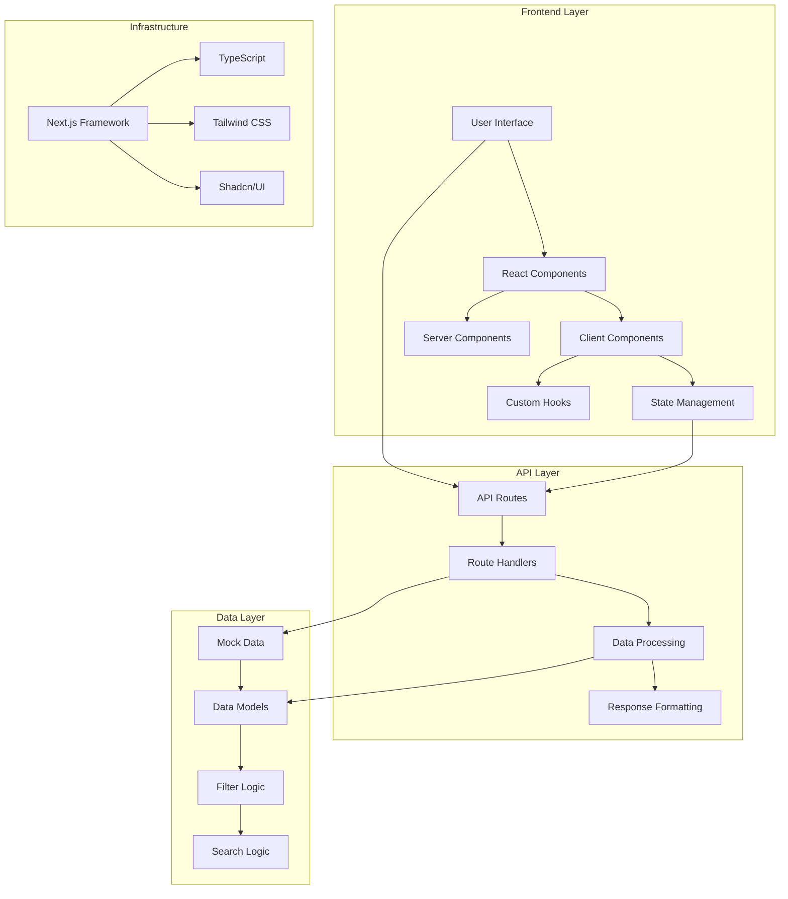
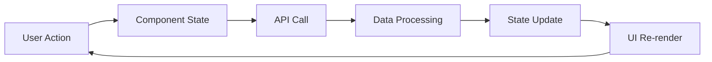

# Arquitetura do Sistema - Portal Cidados

## Visão Geral da Arquitetura

O Portal Cidados segue uma arquitetura moderna baseada em Next.js 15 com App Router, implementando padrões de design que promovem escalabilidade, manutenibilidade e performance.

## Diagrama de Arquitetura



## Camadas da Aplicação

### 1. Camada de Apresentação (Presentation Layer)

#### Componentes de Interface
```typescript
// Estrutura hierárquica
CatalogPage (Client Component)
├── SearchBar (Client Component)
├── CatalogFilters (Client Component)
├── SelectedFilters (Client Component)
├── SortDropdown (Client Component)
├── DataCard (Server Component)
└── CardSkeleton (Server Component)
```

#### Responsabilidades
- **Renderização**: Interface do usuário
- **Interação**: Captura de eventos do usuário
- **Estado Visual**: Gerenciamento de estados de UI
- **Responsividade**: Adaptação a diferentes dispositivos

### 2. Camada de Lógica de Negócio (Business Logic Layer)

#### Gerenciamento de Estado
```typescript
// Estados principais
interface AppState {
  data: DataCatalogItem[];
  loading: boolean;
  initialLoading: boolean;
  filters: CatalogFilters;
  filterOptions: FilterOptions;
  searchTerm: string;
}
```

#### Hooks Customizados
```typescript
// useDebounce - Otimização de performance
export function useDebounce<T>(value: T, delay: number): T

// useCatalogAPI - Gerenciamento de dados (futuro)
export function useCatalogAPI() // Implementação futura
```

### 3. Camada de API (API Layer)

#### Estrutura de Endpoints
```
/api/
└── catalog/
    └── route.ts    # GET /api/catalog
```

#### Processamento de Dados
```typescript
// Fluxo de processamento
Request → Validation → Filtering → Searching → Sorting → Response
```

### 4. Camada de Dados (Data Layer)

#### Estrutura de Dados
```typescript
// Modelo de dados principal
interface DataCatalogItem {
  id: string;
  title: string;
  description: string;
  theme: string;
  region: string;
  accessMethod: string;
  keywords: string[];
  createdAt: string;
  tags: string[];
}
```

#### Lógica de Filtros
```typescript
// Algoritmos de filtragem
- searchItems()     // Busca textual
- filterItems()     // Filtros categóricos
- sortItems()       // Ordenação
```

## Padrões de Design Implementados

### 1. Component Composition Pattern

```typescript
// Composição de componentes
<CatalogPage>
  <SearchBar onSearch={handleSearch} />
  <CatalogFilters onFiltersChange={handleFiltersChange} />
  <SelectedFilters filters={filters} onRemoveFilter={handleRemoveFilter} />
  <SortDropdown onSortChange={handleSortChange} />
  <DataGrid>
    {data.map(item => <DataCard key={item.id} item={item} />)}
  </DataGrid>
</CatalogPage>
```

### 2. Custom Hooks Pattern

```typescript
// Separação de lógica de apresentação
function useDebounce<T>(value: T, delay: number): T {
  // Lógica de debounce isolada
}

function useCatalogFilters() {
  // Lógica de filtros isolada
}
```

### 3. Provider Pattern (Futuro)

```typescript
// Context para estado global (implementação futura)
<CatalogProvider>
  <CatalogPage />
</CatalogProvider>
```

### 4. Factory Pattern

```typescript
// Criação de componentes dinâmicos
const componentFactory = {
  card: (item: DataCatalogItem) => <DataCard item={item} />,
  skeleton: () => <CardSkeleton />
};
```

## Fluxo de Dados

### 1. Fluxo Unidirecional



### 2. Gerenciamento de Estado

#### Estados Locais
```typescript
// Estados específicos de componente
const [searchTerm, setSearchTerm] = useState("");
const [loading, setLoading] = useState(false);
```

#### Estados Compartilhados
```typescript
// Estados que afetam múltiplos componentes
const [filters, setFilters] = useState<CatalogFilters>({});
const [data, setData] = useState<DataCatalogItem[]>([]);
```

### 3. Comunicação Entre Componentes

#### Props Drilling
```typescript
// Passagem de dados via props
<CatalogPage>
  <SearchBar onSearch={handleSearch} />
  <CatalogFilters onFiltersChange={handleFiltersChange} />
</CatalogPage>
```

#### Callback Pattern
```typescript
// Comunicação via callbacks
interface SearchBarProps {
  onSearch: (searchTerm: string) => void;
}

interface CatalogFiltersProps {
  onFiltersChange: (filters: CatalogFilters) => void;
}
```

## Estratégias de Performance

### 1. Code Splitting

```typescript
// Carregamento lazy de componentes
const LazyComponent = lazy(() => import('./LazyComponent'));

// Uso com Suspense
<Suspense fallback={<Loading />}>
  <LazyComponent />
</Suspense>
```

### 2. Memoização

```typescript
// Memoização de componentes
const MemoizedDataCard = memo(DataCard);

// Memoização de funções
const fetchData = useCallback(async (filters) => {
  // Lógica de fetch
}, []);
```

### 3. Debouncing

```typescript
// Debounce para otimizar requisições
const debouncedSearchTerm = useDebounce(searchTerm, 300);
```

### 4. Loading States

```typescript
// Estados de loading granulares
const [initialLoading, setInitialLoading] = useState(true);
const [loading, setLoading] = useState(false);
```

## Estratégias de Caching

### 1. Cache de Dados

```typescript
// Cache automático do Next.js
export async function GET(request: NextRequest) {
  // Dados são cacheados automaticamente
  const data = await getData();
  return NextResponse.json(data);
}
```

### 2. Cache de Filtros

```typescript
// Cache de opções de filtros
const [filterOptions, setFilterOptions] = useState({
  themes: [],
  regions: [],
  accessMethods: []
});
```

### 3. Cache de Componentes

```typescript
// Cache de componentes renderizados
const cachedComponents = useMemo(() => {
  return data.map(item => <DataCard key={item.id} item={item} />);
}, [data]);
```

## Tratamento de Erros

### 1. Error Boundaries (Futuro)

```typescript
// Implementação futura
class ErrorBoundary extends Component {
  constructor(props) {
    super(props);
    this.state = { hasError: false };
  }

  static getDerivedStateFromError(error) {
    return { hasError: true };
  }

  render() {
    if (this.state.hasError) {
      return <ErrorFallback />;
    }
    return this.props.children;
  }
}
```

### 2. Try-Catch em Funções Async

```typescript
// Tratamento de erros em operações assíncronas
try {
  const response = await fetch('/api/catalog');
  const data = await response.json();
  setData(data.data);
} catch (error) {
  console.error('Erro ao buscar dados:', error);
  setError(error.message);
}
```

### 3. Estados de Erro

```typescript
// Estados para diferentes tipos de erro
const [error, setError] = useState<string | null>(null);
const [networkError, setNetworkError] = useState(false);
const [validationError, setValidationError] = useState(false);
```

## Segurança

### 1. Sanitização de Input

```typescript
// Sanitização automática do React
<input
  value={searchTerm}
  onChange={(e) => setSearchTerm(e.target.value)}
  // XSS protection automático
/>
```

### 2. Validação de Dados

```typescript
// Validação de resposta da API
if (!result.data || !Array.isArray(result.data)) {
  throw new Error('Invalid API response');
}
```

### 3. Rate Limiting (Futuro)

```typescript
// Implementação futura
const rateLimiter = new Map();

function checkRateLimit(ip: string): boolean {
  // Lógica de rate limiting
}
```

## Escalabilidade

### 1. Modularização

```typescript
// Estrutura modular
src/
├── components/     # Componentes reutilizáveis
├── hooks/         # Hooks customizados
├── lib/           # Utilitários
├── types/         # Definições de tipos
└── utils/         # Funções auxiliares
```

### 2. Abstração de Camadas

```typescript
// Abstração da camada de dados
interface DataRepository {
  findAll(filters: CatalogFilters): Promise<DataCatalogItem[]>;
  findById(id: string): Promise<DataCatalogItem>;
  search(term: string): Promise<DataCatalogItem[]>;
}

class MockDataRepository implements DataRepository {
  // Implementação com dados mock
}

class ApiDataRepository implements DataRepository {
  // Implementação futura com API real
}
```

### 3. Configuração Flexível

```typescript
// Configuração baseada em ambiente
const config = {
  apiUrl: process.env.NEXT_PUBLIC_API_URL || '/api',
  debounceDelay: process.env.NEXT_PUBLIC_DEBOUNCE_DELAY || 300,
  cacheTimeout: process.env.NEXT_PUBLIC_CACHE_TIMEOUT || 300000
};
```

## Monitoramento e Observabilidade

### 1. Logging

```typescript
// Sistema de logs estruturado
const logger = {
  info: (message: string, data?: any) => console.log(`[INFO] ${message}`, data),
  error: (message: string, error?: Error) => console.error(`[ERROR] ${message}`, error),
  warn: (message: string, data?: any) => console.warn(`[WARN] ${message}`, data)
};
```

### 2. Métricas (Futuro)

```typescript
// Coleta de métricas de performance
const metrics = {
  trackPageView: (page: string) => { /* Implementação futura */ },
  trackUserAction: (action: string, data?: any) => { /* Implementação futura */ },
  trackApiCall: (endpoint: string, duration: number) => { /* Implementação futura */ }
};
```

### 3. Health Checks

```typescript
// Verificação de saúde da aplicação
export async function GET() {
  try {
    // Verificar conectividade com dados
    const data = await getData();
    
    return NextResponse.json({
      status: 'healthy',
      timestamp: new Date().toISOString(),
      dataCount: data.length
    });
  } catch (error) {
    return NextResponse.json({
      status: 'unhealthy',
      error: error.message
    }, { status: 500 });
  }
}
```

## Roadmap Arquitetural

### Versão 1.1.0
- [ ] Implementar Error Boundaries
- [ ] Adicionar sistema de logs estruturado
- [ ] Implementar cache Redis
- [ ] Adicionar rate limiting

### Versão 1.2.0
- [ ] Migrar para banco de dados real
- [ ] Implementar autenticação/autorização
- [ ] Adicionar sistema de notificações
- [ ] Implementar WebSocket para atualizações em tempo real

### Versão 2.0.0
- [ ] Microserviços
- [ ] Kubernetes deployment
- [ ] CI/CD pipeline
- [ ] Monitoring avançado (Prometheus, Grafana)

Esta arquitetura fornece uma base sólida para crescimento e manutenção do Portal Cidados, seguindo as melhores práticas de desenvolvimento moderno.
