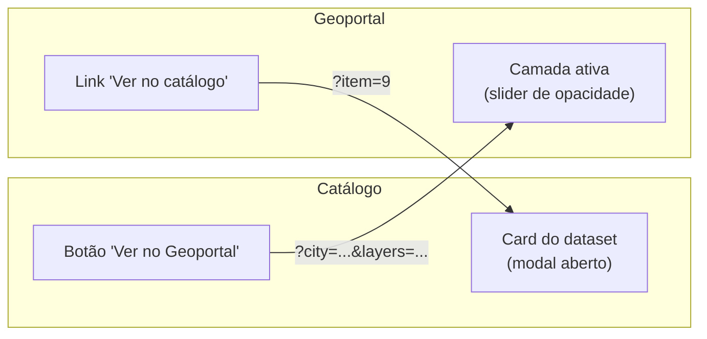
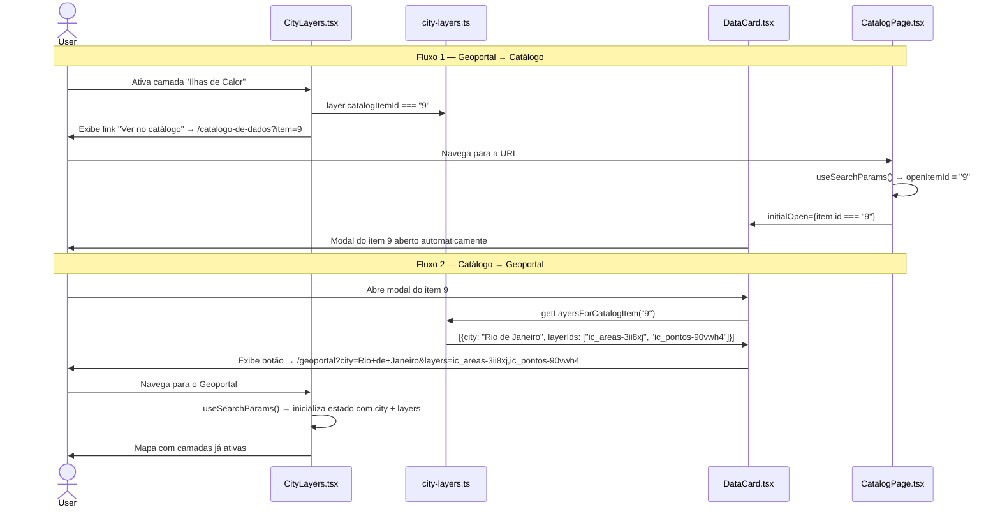

# Integração Bidirecional: Catálogo de Dados ↔ Geoportal

Documentação da feature de navegação bidirecional entre o Catálogo de Dados (`/catalogo-de-dados`) e o Geoportal (`/geoportal`).

---

## Visão Geral

Os datasets publicados no Catálogo de Dados são as mesmas fontes que alimentam as camadas do Geoportal. A integração bidirecional conecta essas duas páginas de forma que o usuário possa navegar de uma para a outra sem perder o contexto — com a camada ou o modal de registro já pré-carregados na página de destino.



---

## Casos de Uso

### Caso 1 — Geoportal → Catálogo

**Cenário:** o usuário está explorando camadas no mapa e quer saber mais sobre a origem dos dados.

1. O usuário seleciona uma camada (ex: **Ilhas de Calor**)
2. Abaixo do slider de opacidade, aparece o link **"Ver no catálogo de dados"**
3. O clique navega para `/catalogo-de-dados?item=9`
4. O Catálogo de Dados abre com o modal do registro **"Medições de temperatura e umidade do ar, Favela da Maré-RJ [2023]"** já expandido

### Caso 2 — Catálogo → Geoportal

**Cenário:** o usuário está pesquisando datasets e quer visualizá-los no mapa.

1. O usuário abre o modal de um dataset que tem camadas correspondentes (ex: **Sinistros de Trânsito**)
2. No modal, aparece o botão **"Ver camadas no Geoportal (São Paulo)"**
3. O clique navega para `/geoportal?city=São+Paulo&layers=sinistros-por-distrito-spo,sinistros-por-trecho-spo`
4. O Geoportal abre com São Paulo selecionado e as duas camadas de sinistros já ativas

---

## URLs de Navegação

### Geoportal → Catálogo

```
/catalogo-de-dados?item={catalogItemId}
```

O `catalogItemId` é definido por camada em `city-layers.ts` e corresponde ao `id` do item em `catalog.ts`.

### Catálogo → Geoportal

```
/geoportal?city={cidade}&layers={layerId1},{layerId2},...
```

Os IDs das camadas são derivados dinamicamente via `getLayersForCatalogItem()` em `city-layers.ts`.

---

## Mapeamento Completo

A tabela abaixo documenta todas as relações entre camadas do Geoportal e registros do Catálogo. O campo `catalogItemId` em cada entrada de `city-layers.ts` é a fonte de verdade.

| Cidade | Layer ID | Nome da Camada | Catalog ID | Título no Catálogo |
|---|---|---|---|---|
| Rio de Janeiro | `ic_areas-3ii8xj` | Ilhas de Calor | **9** | Medições de temperatura e umidade do ar, Favela da Maré-RJ [2023] |
| Rio de Janeiro | `ic_pontos-90vwh4` | Ilhas de Calor (pontos de captura) | **9** | Medições de temperatura e umidade do ar, Favela da Maré-RJ [2023] |
| Rio de Janeiro | `quali_area-1ci0wo` | Qualidade do Ar | **10** | Medições e qualidade do ar, Favela da Maré-RJ [2023] |
| Rio de Janeiro | `quali_pontos-b424eh` | Qualidade do Ar (pontos de captura) | **10** | Medições e qualidade do ar, Favela da Maré-RJ [2023] |
| São Paulo | `faixa-azul-trechos-spo` | Faixa Azul | **16** | Trechos com Faixas Dedicadas a Motociclistas (Faixa Azul) [2022-2025] |
| São Paulo | `sinistros-por-distrito-spo` | Sinistros por Distrito | **15** | Sinistros de Trânsito [2022-2025] |
| São Paulo | `sinistros-por-trecho-spo` | Sinistros em Trechos de Vias | **15** | Sinistros de Trânsito [2022-2025] |
| São Paulo | `densidade-hab-setor` | Densidade Hab. (setor censitário) | **3** | Densidade Populacional e Verticalização [2022,2024] |
| São Paulo | `densidade-hab-distrito-spo` | Densidade Hab. (distrito) | **3** | Densidade Populacional e Verticalização [2022,2024] |
| São Paulo | `densidade-pop-setor-spo` | Densidade Pop. (setor censitário) | **3** | Densidade Populacional e Verticalização [2022,2024] |
| São Paulo | `densidade-pop-distrito-spo` | Densidade Pop. (distrito) | **3** | Densidade Populacional e Verticalização [2022,2024] |
| São Paulo | `verticalizacao-setor` | Verticalização (setor censitário) | **3** | Densidade Populacional e Verticalização [2022,2024] |
| São Paulo | `verticalizacao-distrito-spo` | Verticalização (distrito) | **3** | Densidade Populacional e Verticalização [2022,2024] |
| São Paulo | `raster-dbiubd` | Verticalização (grid) | **3** | Densidade Populacional e Verticalização [2022,2024] |
| São Paulo | `populacao-por-distrito-spo` | População Feminina (distrito) | **3** | Densidade Populacional e Verticalização [2022,2024] |
| São Paulo | `geoses-spo` | GeoSES | **17** | Índice GeoSES [2010] |
| São Paulo | `gastos_ubs_distritos-c6rpx4` | Gastos UBS (distrito) | **6** | Gastos com UBS por distrito [2019] |
| São Paulo | `obitos-47q8aj` | Óbitos por Doenças Cerebrovasculares | **11** | Mortalidade prematura por distrito [2019] |
| Brasil | `tarifa_zero` | Tarifa Zero | — | *(sem correspondência no catálogo)* |

> **Nota:** quando múltiplas camadas apontam para o mesmo `catalogItemId` (ex: catálogo 3 com 7 layers de SP), o botão "Ver no Geoportal" ativa **todas** essas camadas simultaneamente.

---

## Implementação Técnica

### Fonte de verdade: `city-layers.ts`

O campo `catalogItemId` na interface `CityLayer` é o único ponto de configuração do mapeamento:

```ts
// src/app/(app)/geoportal/lib/city-layers.ts

export interface CityLayer {
  id: string;
  name: string;
  // ... outros campos
  catalogItemId?: string;  // ← ID do item em catalog.ts
}
```

### Lookup reverso: `getLayersForCatalogItem()`

Função exportada por `city-layers.ts` que calcula o inverso do mapeamento em tempo de execução:

```ts
export function getLayersForCatalogItem(
  catalogId: string,
): { city: string; layerIds: string[] }[] {
  const result: { city: string; layerIds: string[] }[] = [];
  for (const [city, layers] of Object.entries(cityLayersConfig)) {
    const ids = layers
      .filter((l) => l.catalogItemId === catalogId)
      .map((l) => l.id);
    if (ids.length) result.push({ city, layerIds: ids });
  }
  return result;
}
```

### Fluxo de dados completo



---

## Arquivos Envolvidos

| Arquivo | Papel na integração |
|---|---|
| `src/app/(app)/geoportal/lib/city-layers.ts` | Define `catalogItemId` por camada e exporta `getLayersForCatalogItem()` |
| `src/app/(app)/geoportal/components/city-layers.tsx` | Exibe link "Ver no catálogo" para camadas selecionadas |
| `src/app/(app)/geoportal/components/city-layers-comparison.tsx` | Idem para o modo comparação |
| `src/components/DataCard.tsx` | Aceita `initialOpen`, exibe botão "Ver no Geoportal" |
| `src/components/CatalogPage.tsx` | Lê `?item` da URL e passa `initialOpen` para cada `DataCard` |
| `src/app/(app)/catalogo-de-dados/page.tsx` | Envolve `CatalogPage` em `<Suspense>` (necessário para `useSearchParams`) |

---

## Adicionando um novo mapeamento

Para vincular uma nova camada do Geoportal a um registro do Catálogo, basta adicionar o campo `catalogItemId` ao objeto da camada em `city-layers.ts`:

```ts
{
  id: "minha-nova-camada",
  name: "Minha Camada",
  // ...
  catalogItemId: "42",   // ← ID do item em catalog.ts
}
```

Não é necessário alterar nenhum outro arquivo. O link no Geoportal e o botão no modal do Catálogo aparecem automaticamente.

Para criar uma nova entrada no Catálogo, adicione o item em `src/lib/data/catalog.ts` com um `id` único e defina o `catalogItemId` correspondente na(s) camada(s) de `city-layers.ts`.
