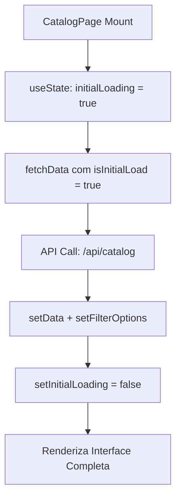
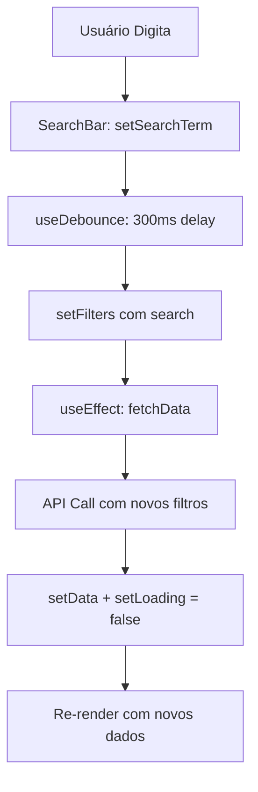
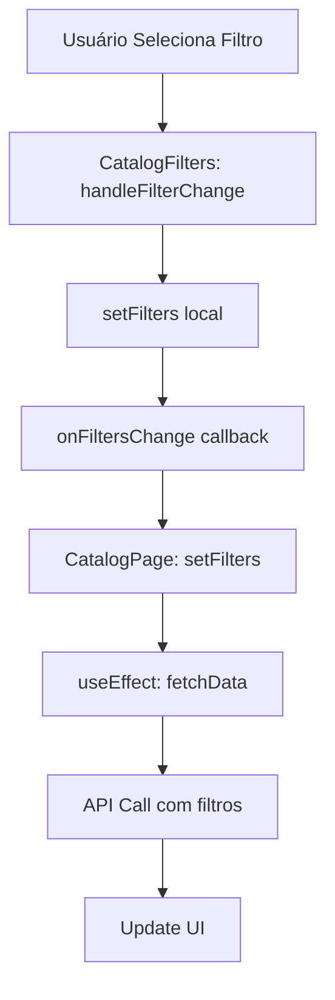

# Frontend Integration - Portal Cidados

## Visão Geral

Este documento descreve como o frontend do Portal Cidados se integra com a API, incluindo a arquitetura de componentes, gerenciamento de estado, e fluxo de dados.

## Arquitetura de Componentes

### Estrutura Hierárquica

```
CatalogPage (Client Component)
├── SearchBar (Client Component)
├── CatalogFilters (Client Component)
├── SelectedFilters (Client Component)
├── SortDropdown (Client Component)
├── DataCard (Server Component)
└── CardSkeleton (Server Component)
```

### Responsabilidades dos Componentes

| Componente | Tipo | Responsabilidade |
|------------|------|------------------|
| `CatalogPage` | Client | Gerenciamento de estado, integração com API |
| `SearchBar` | Client | Captura de input do usuário |
| `CatalogFilters` | Client | Interface de filtros |
| `SelectedFilters` | Client | Exibição de filtros ativos |
| `SortDropdown` | Client | Controle de ordenação |
| `DataCard` | Server | Exibição de dados |
| `CardSkeleton` | Server | Loading states |

## Fluxo de Dados

### 1. Inicialização



### 2. Busca com Debounce



### 3. Filtros



## Gerenciamento de Estado

### Estados Principais

```typescript
// CatalogPage.tsx
const [data, setData] = useState<DataCatalogItem[]>([]);
const [loading, setLoading] = useState(true);
const [initialLoading, setInitialLoading] = useState(true);
const [filters, setFilters] = useState<FiltersType>({ sortBy: "newest" });
const [filterOptions, setFilterOptions] = useState<FilterOptions>({
  themes: [],
  regions: [],
  accessMethods: [],
});
const [searchTerm, setSearchTerm] = useState("");
```

### Ciclo de Vida dos Estados

1. **Initial Loading**: Mostra skeleton completo
2. **Data Loading**: Mostra skeleton apenas nos cards
3. **Data Loaded**: Exibe dados reais
4. **Search Loading**: Mostra skeleton nos cards durante busca
5. **Filter Loading**: Atualiza dados sem reload completo

## Hooks Customizados

### useDebounce

```typescript
// src/hooks/useDebounce.ts
export function useDebounce<T>(value: T, delay: number): T {
  const [debouncedValue, setDebouncedValue] = useState<T>(value);
  const timeoutRef = useRef<NodeJS.Timeout | null>(null);

  useEffect(() => {
    if (timeoutRef.current) {
      clearTimeout(timeoutRef.current);
    }

    timeoutRef.current = setTimeout(() => {
      setDebouncedValue(value);
    }, delay);

    return () => {
      if (timeoutRef.current) {
        clearTimeout(timeoutRef.current);
      }
    };
  }, [value, delay]);

  return debouncedValue;
}
```

**Uso no CatalogPage:**
```typescript
const debouncedSearchTerm = useDebounce(searchTerm, 300);

useEffect(() => {
  setFilters(prev => ({ ...prev, search: debouncedSearchTerm }));
}, [debouncedSearchTerm]);
```

## Integração com API

### Função fetchData

```typescript
const fetchData = useCallback(
  async (currentFilters: FiltersType, isInitialLoad = false) => {
    if (!isInitialLoad) {
      setLoading(true);
    }

    try {
      const params = new URLSearchParams();

      if (currentFilters.search) params.append("search", currentFilters.search);
      if (currentFilters.theme) params.append("theme", currentFilters.theme);
      if (currentFilters.region) params.append("region", currentFilters.region);
      if (currentFilters.accessMethod) params.append("accessMethod", currentFilters.accessMethod);
      if (currentFilters.sortBy) params.append("sortBy", currentFilters.sortBy);

      const response = await fetch(`/api/catalog?${params.toString()}`);
      const result: CatalogResponse = await response.json();

      setData(result.data);

      if (isInitialLoad) {
        setFilterOptions(result.filters);
      }
    } catch (error) {
      console.error("Error fetching catalog data:", error);
    } finally {
      setLoading(false);
      if (isInitialLoad) {
        setInitialLoading(false);
      }
    }
  },
  [],
);
```

### Tratamento de Erros

```typescript
try {
  const response = await fetch(`/api/catalog?${params.toString()}`);
  const result: CatalogResponse = await response.json();
  setData(result.data);
} catch (error) {
  console.error("Error fetching catalog data:", error);
  // Estado permanece inalterado em caso de erro
}
```

## Performance e Otimizações

### 1. Debounce na Busca

- **Delay**: 300ms
- **Benefício**: Reduz requisições durante digitação
- **Implementação**: Hook customizado `useDebounce`

### 2. Cache de Filtros

```typescript
// Filtros são carregados apenas uma vez
if (isInitialLoad) {
  setFilterOptions(result.filters);
}
```

### 3. Loading States Inteligentes

```typescript
// Loading inicial vs loading de busca
if (initialLoading) {
  return <FullPageSkeleton />;
}

// Loading apenas nos cards durante busca
{loading ? <CardSkeleton /> : <DataCard />}
```

### 4. Memoização

```typescript
const fetchData = useCallback(async (currentFilters, isInitialLoad) => {
  // Função memoizada para evitar re-criações desnecessárias
}, []);
```

## Fluxo de Interação do Usuário

### Cenário 1: Primeira Visita

1. Usuário acessa `/catalogo-de-dados`
2. `initialLoading = true` → Skeleton completo
3. `fetchData` com `isInitialLoad = true`
4. API retorna dados + opções de filtros
5. `initialLoading = false` → Interface completa

### Cenário 2: Busca

1. Usuário digita no campo de busca
2. `setSearchTerm` (imediato)
3. `useDebounce` aguarda 300ms
4. `setFilters` com termo de busca
5. `fetchData` executa
6. `loading = true` → Skeleton nos cards
7. Dados retornam → `loading = false` → Cards reais

### Cenário 3: Filtros

1. Usuário seleciona filtro
2. `handleFilterChange` no `CatalogFilters`
3. `onFiltersChange` callback para `CatalogPage`
4. `setFilters` atualiza estado
5. `fetchData` executa com novos filtros
6. Interface atualiza com dados filtrados

### Cenário 4: Ordenação

1. Usuário seleciona opção no dropdown
2. `handleSortChange` atualiza `filters.sortBy`
3. `fetchData` executa com nova ordenação
4. Cards são reordenados

## Tratamento de Estados Vazios

### Nenhum Resultado

```typescript
{data.length === 0 && !loading && (
  <div className="text-center py-12">
    <p className="text-gray-500">
      Nenhum resultado encontrado com os filtros selecionados.
    </p>
  </div>
)}
```

### Estados de Loading

```typescript
// Loading inicial
if (initialLoading) {
  return <FullPageSkeleton />;
}

// Loading durante busca
{loading ? <CardSkeleton /> : <DataCard />}
```

## Responsividade

### Breakpoints

- **Mobile**: 1 coluna
- **Tablet**: 2 colunas (`md:grid-cols-2`)
- **Desktop**: 3 colunas (`xl:grid-cols-3`)

### Layout Adaptativo

```typescript
<div className="grid grid-cols-1 md:grid-cols-2 xl:grid-cols-3 gap-6">
  {/* Cards se adaptam automaticamente */}
</div>
```

## Acessibilidade

### ARIA Labels

```typescript
<Input
  type="text"
  placeholder="Pesquisar por palavra-chave"
  aria-label="Campo de busca do catálogo"
/>
```

### Navegação por Teclado

- Todos os componentes são navegáveis por teclado
- Foco visível em todos os elementos interativos
- Suporte a screen readers

## Debugging e Monitoramento

### Console Logs

```typescript
console.error("Error fetching catalog data:", error);
```

### Estados de Debug

```typescript
// Adicionar em desenvolvimento
console.log("Current filters:", filters);
console.log("API response:", result);
```

## Próximas Melhorias

### 1. Error Boundaries

```typescript
// Implementar para capturar erros de renderização
<ErrorBoundary fallback={<ErrorFallback />}>
  <CatalogPage />
</ErrorBoundary>
```

### 2. Retry Logic

```typescript
// Implementar retry automático em caso de falha
const retryFetch = useCallback(async (retries = 3) => {
  // Lógica de retry
}, []);
```

### 3. Offline Support

```typescript
// Service Worker para cache offline
// PWA capabilities
```

### 4. Analytics

```typescript
// Tracking de interações do usuário
// Métricas de performance
```

## Considerações de Segurança

### 1. Sanitização de Input

```typescript
// Inputs são automaticamente sanitizados pelo React
// XSS protection nativo
```

### 2. Validação de Dados

```typescript
// Validação de resposta da API
if (!result.data || !Array.isArray(result.data)) {
  throw new Error("Invalid API response");
}
```

### 3. Rate Limiting

```typescript
// Implementar rate limiting no frontend
// Debounce já implementado reduz requisições
```

Esta documentação fornece uma visão completa de como o frontend se integra com a API, incluindo todos os aspectos técnicos e de experiência do usuário.

