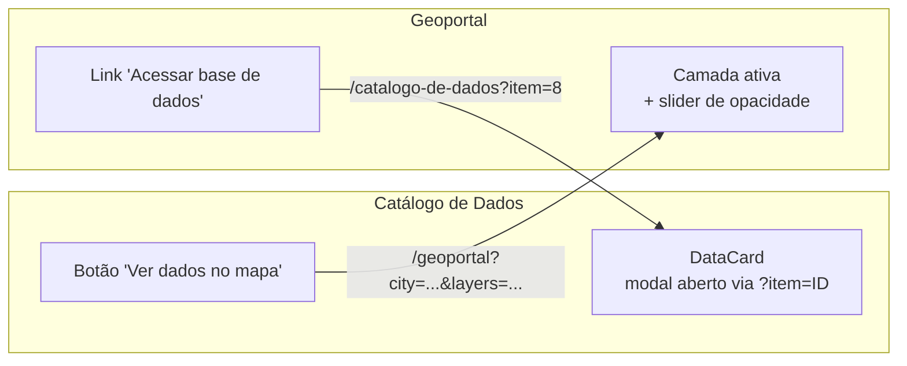

# Portal Cidadãos — Índice da Documentação

Documentação técnica completa do Portal Cidadãos para desenvolvedores, arquitetos e equipe de produto.

---

## Documentos

| Documento | Descrição | Público-alvo |
|---|---|---|
| **[README](./README.md)** | Visão geral, tecnologias e configuração | Todos |
| **[Arquitetura](./ARCHITECTURE.md)** | Arquitetura do sistema e padrões de design | Desenvolvedores / Arquitetos |
| **[Analytics](./ANALYTICS.md)** | Google Analytics 4 + Microsoft Clarity: integração, CSP e ambientes | Desenvolvedores / Produto |
| **[API Documentation](./API_DOCUMENTATION.md)** | Especificação completa da API REST | Desenvolvedores Backend/Frontend |
| **[Frontend Integration](./FRONTEND_INTEGRATION.md)** | Como o frontend se integra com a API | Desenvolvedores Frontend |
| **[API Examples](./API_EXAMPLES.md)** | Exemplos práticos de uso da API | Desenvolvedores |
| **[Integração Catálogo ↔ Geoportal](./CATALOG_GEOPORTAL_INTEGRATION.md)** | Navegação bidirecional entre as duas páginas | Desenvolvedores / Produto |

### Documentação do Geoportal (no módulo)

| Documento | Descrição |
|---|---|
| **[Geoportal README](../src/app/(app)/geoportal/README.md)** | Visão completa do módulo: features, URL state, camadas, comparação |
| **[Workflow de Layers](../src/app/(app)/geoportal/WORKFLOW.md)** | Do Mapbox Studio ao Geoportal: passo a passo para adicionar layers |
| **[Layer Styles Guide](../src/app/(app)/geoportal/LAYER_STYLES_GUIDE.md)** | Como configurar estilos visuais Mapbox |

---

## Módulos principais

### Catálogo de Dados (`/catalogo-de-dados`)

Página de busca e exploração dos datasets publicados. Suporta filtros por tema, região e método de acesso. Cada card abre um modal com detalhes completos e links para download.

**Features:**
- Busca textual com debounce de 300ms
- Filtros combináveis (tema, região, acesso)
- Ordenação por data
- Modal de detalhes com datasets disponíveis
- **Abertura de modal via URL** (`?item=ID`)
- **Link direto para o Geoportal** quando o dataset tem camadas correspondentes

**Arquivos-chave:**
```
src/components/CatalogPage.tsx   — orquestrador (estado + filtros + URL)
src/components/DataCard.tsx      — card + modal + integração geoportal
src/lib/data/catalog.ts          — dados dos registros
src/app/api/catalog/route.ts     — API de filtros e busca
```

---

### Geoportal (`/geoportal`)

Mapa interativo baseado em Mapbox GL JS. Permite explorar camadas geoespaciais por cidade, comparar camadas lado a lado e compartilhar visualizações via URL.

**Features:**
- Seleção de cidade (Rio de Janeiro, São Paulo, Brasil)
- Toggle de camadas com opacidade ajustável
- Modo de comparação (slider divisório)
- Estado completo serializado na URL (cidade, camadas, opacidades, viewport, tema)
- Hover popup com atributos do feature
- Legenda automática por layer
- **Link direto para o Catálogo** quando a camada tem dataset correspondente

**Arquivos-chave:**
```
src/app/(app)/geoportal/components/property-map.tsx        — orquestrador principal
src/app/(app)/geoportal/lib/city-layers.ts                 — config de camadas + mapeamento catálogo
src/app/(app)/geoportal/lib/layer-styles.ts                — estilos visuais Mapbox
```

---

### Integração bidirecional



Veja a documentação completa em **[CATALOG_GEOPORTAL_INTEGRATION.md](./CATALOG_GEOPORTAL_INTEGRATION.md)**.

---

## Tecnologias

| Camada | Tecnologia |
|---|---|
| Framework | Next.js 15 (App Router) |
| Linguagem | TypeScript |
| Estilo | Tailwind CSS |
| Componentes | Shadcn/UI |
| Mapa | Mapbox GL JS |
| Comparação de mapas | mapbox-gl-compare |
| Linting / Formatação | Biome |

---

## Configuração rápida

```bash
# Instalar dependências
npm install

# Configurar variável de ambiente do Mapbox
echo "NEXT_PUBLIC_MAPBOX_TOKEN=pk.eyJ1..." >> .env.local

# Desenvolvimento
npm run dev

# Build de produção
npm run build
```

---

## Funcionalidades implementadas

| Feature | Status |
|---|---|
| Busca textual com debounce | ✅ |
| Filtros combináveis no catálogo | ✅ |
| Ordenação por data | ✅ |
| Interface responsiva | ✅ |
| Geoportal com Mapbox GL JS | ✅ |
| Seleção de cidade + camadas | ✅ |
| Opacidade por camada | ✅ |
| Modo de comparação de camadas | ✅ |
| Estado do mapa serializado na URL | ✅ |
| Tema dark/light persistido na URL | ✅ |
| Hover popup com atributos | ✅ |
| Legenda automática | ✅ |
| Integração bidirecional Catálogo ↔ Geoportal | ✅ |
| Abertura de modal do catálogo via URL | ✅ |
| Google Analytics 4 | ✅ |
| Microsoft Clarity (heatmaps + gravações) | ✅ |
