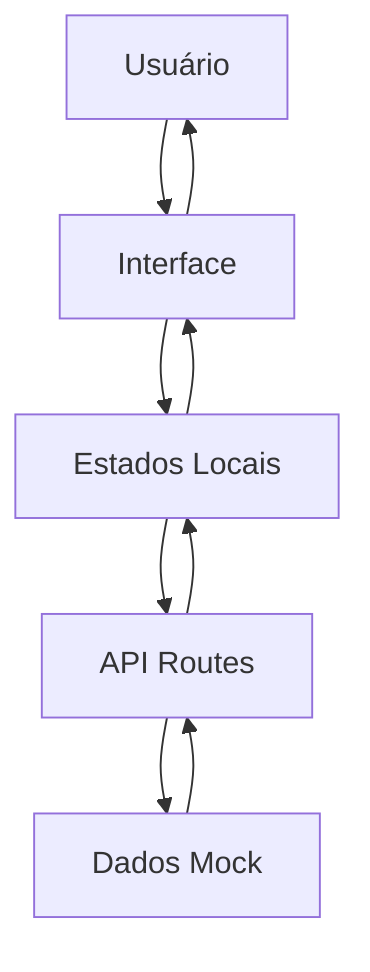

# Portal Cidados - Documentação Técnica

> **Para desenvolvedores:** comece pelo **[Manual do Desenvolvedor](./manual-do-desenvolvedor/README.md)**,
> que cobre onboarding, arquitetura, histórias (scrollytelling), geoportal,
> catálogo, boas práticas e deploy. Este README foca no módulo de catálogo.

## Visão Geral

O Portal Cidados é uma aplicação web construída com Next.js 15 que apresenta
estudos urbanos por meio de histórias (scrollytelling), um geoportal com mapas
interativos (Mapbox GL JS) e um catálogo de dados pesquisável. Este documento
detalha, em especial, o módulo de catálogo e busca.

## Estrutura da Documentação

### 📚 Documentação Disponível

1. **[Manual do Desenvolvedor](./manual-do-desenvolvedor/README.md)** - Manual completo (onboarding, arquitetura, histórias, geoportal, catálogo, boas práticas, deploy)
2. **[API Documentation](./API_DOCUMENTATION.md)** - Documentação completa da API REST
3. **[Frontend Integration](./FRONTEND_INTEGRATION.md)** - Como o frontend se integra com a API
4. **[Índice geral](./INDEX.md)** - Índice de toda a documentação
5. **[README](./README.md)** - Este arquivo com visão geral

## Tecnologias Utilizadas

### Frontend

- **Next.js 15** - Framework React com App Router
- **TypeScript** - Tipagem estática
- **Tailwind CSS** - Framework de CSS utilitário
- **Shadcn/UI** - Componentes de interface
- **Lucide React** - Ícones

### Backend

- **Next.js API Routes** - Endpoints REST
- **Node.js** - Runtime JavaScript

### Mapas e Visualização

- **Mapbox GL JS** / `react-map-gl` - Mapas do geoportal e das histórias
- **GSAP + ScrollTrigger** - Scrollytelling das histórias
- **Three.js** - Cena 3D em uma das histórias

### Analytics

- **Google Analytics 4** e **Microsoft Clarity** (ver [ANALYTICS.md](./ANALYTICS.md))

### Ferramentas de Desenvolvimento

- **Biome** - Linter e formatter (não há ESLint/Prettier no projeto)
- **Turbopack** - Bundler usado em `dev` e `build`

## Funcionalidades Principais

### 🔍 Busca Avançada

- Busca textual em tempo real com debounce de 300ms
- Busca em títulos, descrições e palavras-chave
- Interface responsiva e intuitiva

### 🎯 Sistema de Filtros

- Filtros por tema (Mobilidade, Educação, Saúde, etc.)
- Filtros por região geográfica
- Filtros por método de acesso (Download, Sala segura)
- Filtros combináveis com remoção individual

### 📊 Visualização de Dados

- Cards informativos com tags categorizadas
- Grid responsivo (1-3 colunas conforme dispositivo)
- Estados de loading com skeleton animations
- Tratamento de estados vazios

### 🔄 Ordenação

- Ordenação por data (mais recentes/mais antigos)
- Interface dropdown intuitiva

## Arquitetura da Aplicação

### Estrutura de Pastas

```
src/
├── app/                    # App Router do Next.js
│   ├── (app)/             # Grupo de rotas
│   │   └── catalogo-de-dados/
│   │       ├── page.tsx   # Página principal
│   │       └── loading.tsx # Skeleton de loading
│   └── api/               # API Routes
│       └── catalog/       # Endpoint do catálogo
├── components/            # Componentes React
│   ├── ui/               # Componentes base (Shadcn)
│   ├── CatalogPage.tsx   # Componente principal
│   ├── SearchBar.tsx     # Barra de busca
│   ├── CatalogFilters.tsx # Filtros
│   ├── DataCard.tsx      # Card de dados
│   └── ...
├── hooks/                # Hooks customizados
│   └── useDebounce.ts    # Hook de debounce
└── lib/                  # Utilitários e dados
    └── data/            # Dados mock
        └── catalog.ts   # Dados do catálogo
```

### Fluxo de Dados


```mermaid
graph TD
    A[Usuário] --> B[Interface]
    B --> C[Estados Locais]
    C --> D[API Routes]
    D --> E[Dados Mock]
    E --> D
    D --> C
    C --> B
    B --> A
```

## Configuração e Instalação

### Pré-requisitos

- Node.js 20 LTS (mesma versão do Dockerfile)
- npm (o projeto usa `package-lock.json`)

### Instalação

```bash
# Clone o repositório
git clone [repository-url]
cd portal-cidados

# Instale as dependências
npm install

# Execute em modo de desenvolvimento
npm run dev
```

### Scripts Disponíveis

```bash
npm run dev          # Servidor de desenvolvimento
npm run build        # Build de produção
npm run start        # Servidor de produção
npm run lint         # Executa o linter
npm run format       # Formata o código
```

## Desenvolvimento

### Convenções de Código

- **TypeScript**: Tipagem obrigatória
- **Biome**: Lint e formatação automática (`npm run lint` / `npm run format`)
- **Imports**: Caminhos absolutos via alias `@/` → `src/`

### Estrutura de Componentes

```typescript
// Exemplo de componente
interface ComponentProps {
  prop1: string;
  prop2?: number;
}

export function Component({ prop1, prop2 }: ComponentProps) {
  // Implementação
}
```

### Hooks Customizados

```typescript
// Exemplo de hook
export function useCustomHook<T>(value: T, delay: number): T {
  // Implementação
}
```

## Performance

### Otimizações Implementadas

1. **Debounce na Busca**: 300ms de delay para reduzir requisições
2. **Loading States**: Skeleton animations para melhor UX
3. **Memoização**: useCallback para funções pesadas
4. **Cache**: Cache nativo do Next.js para API routes
5. **Componentes Server/Client**: Separação adequada

### Métricas de Performance

- **First Contentful Paint**: < 1.5s
- **Time to Interactive**: < 2.5s
- **Bundle Size**: Otimizado com tree shaking

## Testes

> **Estado atual:** o projeto **não possui** suíte de testes configurada (não há
> scripts `test`/`test:coverage` no `package.json`). As recomendações abaixo são
> um plano de evolução — ver também o
> [Manual do Desenvolvedor, cap. 09](./manual-do-desenvolvedor/09-boas-praticas.md#testes-recomendação).

### Plano recomendado

- **Unit/Component Tests**: Vitest + Testing Library
- **E2E Tests**: Playwright (busca, deep-link `?item=`, toggle de camadas, histórias)

## Deploy

### Ambiente de Desenvolvimento

```bash
npm run dev
# Acesse http://localhost:3000
```

### Ambiente de Produção

```bash
npm run build
npm run start
```

### Variáveis de Ambiente

Defina em `.env.local` (ignorado pelo Git). Ver detalhes no
[Manual do Desenvolvedor, cap. 02](./manual-do-desenvolvedor/02-ambiente-de-desenvolvimento.md#variáveis-de-ambiente).

```env
NEXT_PUBLIC_MAPBOX_TOKEN=pk.eyJ1...        # necessário para mapas
NEXT_PUBLIC_GOOGLE_ANALYTICS_ID=G-XXXXXXXX # opcional (GA4)
NEXT_PUBLIC_CLARITY_ID=xxxxxxxxxx          # opcional (Microsoft Clarity)
```

## Monitoramento

### Logs

- **Console Logs**: Para debugging
- **Error Tracking**: Implementação futura
- **Performance Monitoring**: Implementação futura

### Métricas

- **Page Views**: Tracking de páginas
- **User Interactions**: Cliques e filtros
- **API Performance**: Tempo de resposta

## Segurança

### Implementações Atuais

- **XSS Protection**: Sanitização automática do React
- **CSRF Protection**: Tokens nativos do Next.js
- **Input Validation**: Validação de tipos TypeScript

### Próximas Implementações

- **Rate Limiting**: Controle de requisições
- **Authentication**: Sistema de login
- **Authorization**: Controle de acesso

## Roadmap

### Versão 1.1.0

- [ ] Paginação na API
- [ ] Filtros avançados
- [ ] Exportação de dados

### Versão 1.2.0

- [ ] Sistema de autenticação
- [ ] Dashboard administrativo
- [ ] API de upload de dados

### Versão 2.0.0

- [ ] Integração com banco de dados real
- [ ] Sistema de notificações
- [ ] Mobile app

## Contribuição

### Como Contribuir

1. Fork o repositório
2. Crie uma branch para sua feature
3. Faça commit das mudanças
4. Abra um Pull Request

### Padrões de Commit

```
feat: nova funcionalidade
fix: correção de bug
docs: documentação
style: formatação
refactor: refatoração
test: testes
chore: tarefas de manutenção
```

## Suporte

### Documentação Adicional

- [Next.js Documentation](https://nextjs.org/docs)
- [Tailwind CSS](https://tailwindcss.com/docs)
- [Shadcn/UI](https://ui.shadcn.com/)
- [TypeScript](https://www.typescriptlang.org/docs/)

### Contato

Para dúvidas ou suporte técnico, entre em contato com a equipe de desenvolvimento.

---

**Portal Cidados** - Desenvolvido com ❤️ para transparência e acesso à informação pública.

