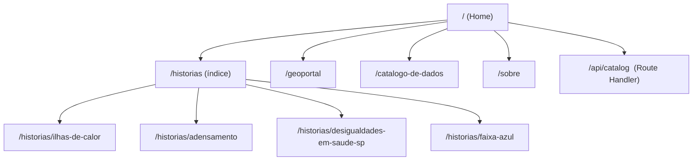

# 01 — Visão Geral

[← Voltar ao índice](./README.md)

## Sumário

- [O que é o Portal Cidados](#o-que-é-o-portal-cidadãos)
- [Propósito e público](#propósito-e-público)
- [Módulos da plataforma](#módulos-da-plataforma)
- [Mapa de rotas](#mapa-de-rotas)
- [Stack tecnológica (resumo)](#stack-tecnológica-resumo)
- [Referências de design (Figma)](#referências-de-design-figma)
- [Glossário](#glossário)

---

## O que é o Portal Cidados

O Portal Cidados (também grafado internamente como *Portal Cidados* e exibido na
home como **CIDADES@DADOS**) é uma plataforma web criada pelo **Centro de Estudos
das Cidades – Laboratório Arq.Futuro do Insper**. Ela apresenta estudos e
pesquisas por meio de **narrativas baseadas em dados** (data storytelling),
aproximando a produção científica da sociedade e do debate público sobre
políticas urbanas.

A plataforma combina três formas de acesso ao mesmo acervo de dados urbanos:

1. **Histórias** — reportagens interativas de *scrollytelling* que guiam o leitor
   por uma narrativa conforme ele rola a página (mapas, gráficos e cards que se
   movem e reagem ao scroll).
2. **Geoportal** — um mapa interativo (Mapbox GL JS) para explorar camadas
   geoespaciais por cidade, comparar camadas e compartilhar visualizações.
3. **Catálogo de Dados** — um índice pesquisável dos datasets publicados, com
   filtros e links diretos para o mapa.

## Propósito e público

- **Missão:** tornar dados sobre as cidades mais compreensíveis e acessíveis,
  contribuindo para políticas públicas baseadas em evidências.
- **Público final:** gestores públicos, pesquisadores, jornalistas e cidadãos.
- **Idioma:** todo o conteúdo e a interface são em **Português (BR)**
  (`<html lang="pt-BR">`).

## Módulos da plataforma

| Módulo | Rota | Descrição | Capítulo |
|---|---|---|---|
| Home | `/` | Página inicial com apresentação e vitrine de histórias | [05](./05-home-e-navegacao.md) |
| Histórias | `/historias` e `/historias/[slug]` | Índice e páginas de scrollytelling | [06](./06-historias-scrollytelling.md) |
| Geoportal | `/geoportal` | Mapa interativo com camadas por cidade | [07](./07-geoportal.md) |
| Catálogo de Dados | `/catalogo-de-dados` | Busca e filtros de datasets | [08](./08-catalogo-de-dados.md) |
| Sobre | `/sobre` | Página institucional e colaboradores | — |
| API do catálogo | `/api/catalog` | Endpoint REST de busca/filtro | [08](./08-catalogo-de-dados.md) |

As histórias publicadas hoje são:

- `ilhas-de-calor` — Diagnóstico sobre ilhas de calor e qualidade do ar na Maré
- `adensamento` — Verticalização e adensamento populacional / Plano Diretor
- `desigualdades-em-saude-sp` — Desigualdades em saúde no município de São Paulo
- `faixa-azul` — Impacto das faixas azuis (motociclistas) nos sinistros em SP

Os metadados dessas histórias para a home vivem em
[`src/lib/data/stories.ts`](../../src/lib/data/stories.ts).

## Mapa de rotas

Todas as rotas de aplicação ficam sob o *route group* `(app)`, exceto a Home
(`src/app/page.tsx`) e a API (`src/app/api/`). Os *route groups* — pastas entre
parênteses como `(app)` e `(stories)` — **não** aparecem na URL; servem apenas
para organização e para aplicar layouts. Ver detalhes no capítulo
[03 — Arquitetura e Convenções](./03-arquitetura-e-convencoes.md).

## Stack tecnológica (resumo)

| Camada | Tecnologia |
|---|---|
| Framework | Next.js 15 (App Router) + Turbopack |
| Runtime UI | React 19 |
| Linguagem | TypeScript (strict) |
| Estilo | Tailwind CSS v4 (CSS-first, sem `tailwind.config`) |
| Componentes | Shadcn/UI (estilo "new-york") + Radix UI |
| Mapas | Mapbox GL JS, `react-map-gl`, `mapbox-gl-compare` |
| Animação/Scrollytelling | GSAP + ScrollTrigger + `@gsap/react`; Three.js (3D); Swiper |
| Analytics | Google Analytics 4 + Microsoft Clarity |
| Lint/Format | Biome |
| Deploy | Docker (Next.js `output: "standalone"`) |

A stack completa e as convenções estão detalhadas no capítulo
[03](./03-arquitetura-e-convencoes.md).

## Referências de design (Figma)

O design da plataforma (protótipos de tela, guia de estilo, tipografia, paleta e
componentes) é mantido no Figma. **Consulte-o antes de implementar ou alterar
telas** para manter aderência ao guia de estilo:

- **[Figma — Insper / Portal Cidados](https://www.figma.com/design/OtdMzKBFGyp11J83d1CEZe/Insper?node-id=622-2&p=f&t=jMWSa84eSwBGp2ii-0)**

## Glossário

| Termo | Significado |
|---|---|
| **Scrollytelling** | Técnica de narrativa em que o conteúdo (mapa/gráfico/imagem) reage à rolagem da página. Ver capítulo [06](./06-historias-scrollytelling.md). |
| **História / Story** | Uma página de scrollytelling completa (ex.: `faixa-azul`). |
| **Capa (cover) / Intro** | Primeira seção de uma história, em tela cheia, com título e autores. |
| **Corpo** | Seções de prosa estática entre os blocos interativos. |
| **Card de texto móvel / Scroll card** | Cartão de texto que rola sobre um fundo fixo (*sticky*) durante o scroll. |
| **Layer / Camada** | Conjunto de dados geoespaciais exibido no mapa (Mapbox). |
| **Tileset** | Dado geoespacial hospedado no Mapbox Studio, referenciado por um ID. |
| **Route group** | Pasta entre parênteses no App Router que agrupa rotas sem afetar a URL. |
| **Basemap** | Estilo base do mapa (claro/escuro). |
| **Deep link** | URL que restaura um estado específico da aplicação (ex.: `?item=8`). |

---

[← Voltar ao índice](./README.md) · [Próximo: 02 — Ambiente de Desenvolvimento →](./02-ambiente-de-desenvolvimento.md)
