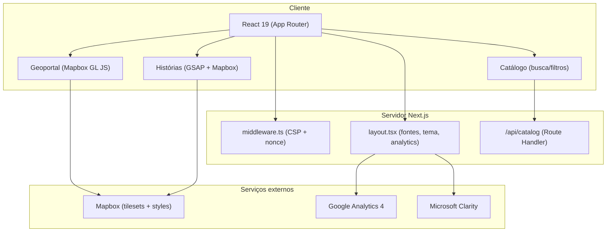

# 03 — Arquitetura e Convenções

[← Voltar ao índice](./README.md)

## Sumário

- [Visão de alto nível](#visão-de-alto-nível)
- [App Router e route groups](#app-router-e-route-groups)
- [Layout raiz e providers](#layout-raiz-e-providers)
- [Layouts aninhados](#layouts-aninhados)
- [Middleware, CSP e segurança](#middleware-csp-e-segurança)
- [Analytics](#analytics)
- [Camada de dados](#camada-de-dados)
- [Componentes, hooks e types compartilhados](#componentes-hooks-e-types-compartilhados)
- [Client vs Server Components](#client-vs-server-components)
- [Convenções gerais](#convenções-gerais)

---

## Visão de alto nível

O Portal Cidados é uma aplicação **Next.js 15 com App Router**. Não há backend
próprio além de um Route Handler (`/api/catalog`); os dados geoespaciais vêm de
**tilesets do Mapbox** consumidos no cliente, e os dados do catálogo/histórias
são **módulos TypeScript estáticos** em `src/lib/data/`.



## App Router e route groups

A aplicação usa **route groups** (pastas entre parênteses) que **não aparecem na
URL**:

- **`(app)`** — agrupa as páginas principais (`catalogo-de-dados`, `geoportal`,
  `historias`, `sobre`). É apenas organizacional (não possui `layout.tsx`
  próprio). A Home (`src/app/page.tsx`) e a API ficam fora desse grupo.
- **`(stories)`** — dentro de `historias/`, agrupa as páginas individuais de
  scrollytelling e aplica um layout que força o tema claro.

Convenções do App Router **atualmente ausentes** (oportunidades de melhoria):
não há `error.tsx`, `not-found.tsx` ou `loading.tsx` globais. Apenas uma
história possui um componente de loading local. Ver
[capítulo 09](./09-boas-praticas.md).

## Layout raiz e providers

O layout raiz [`src/app/layout.tsx`](../../src/app/layout.tsx) é um **Server
Component assíncrono** responsável por: carregar fontes, aplicar o
`ThemeProvider`, montar o `Toaster` (sonner) e injetar analytics com nonce CSP.

```tsx
export default async function RootLayout({ children }) {
  const nonce = (await headers()).get("x-nonce") ?? "";
  return (
    <html lang="pt-BR" nonce={nonce} suppressHydrationWarning>
      <head>
        <GoogleAnalytics gaId={...} nonce={nonce} debugMode={...} />
        <ClarityInit />
      </head>
      <body className={`${geistSans.variable} ... ${inter.variable} antialiased`}>
        <ThemeProvider attribute="class" defaultTheme="light" enableSystem disableTransitionOnChange>
          <Toaster />
          {children}
        </ThemeProvider>
      </body>
    </html>
  );
}
```

Fontes carregadas (expostas como CSS variables e mapeadas em `globals.css`):

| Fonte | Origem | Variável |
|---|---|---|
| Geist Sans | `next/font/google` | `--font-geist-sans` |
| Geist Mono | `next/font/google` | `--font-geist-mono` |
| Inter | `next/font/google` | `--font-inter` |
| GT Ultra | local (`.otf`, pesos 100–900) | `--font-gt-ultra` |
| GT Ultra Fine | local (`.otf`, pesos 100–900) | `--font-gt-ultra-fine` |

Providers:

- **`ThemeProvider`** — wrapper de `next-themes`
  ([`src/components/theme-provider.tsx`](../../src/components/theme-provider.tsx)),
  com `attribute="class"`, `defaultTheme="light"` e `enableSystem`.
- **`Toaster`** — importado direto de `sonner` para toasts globais.

> **Importante:** não há navbar/footer no layout raiz. A navegação é
> **por página**, via o componente `Header` importado em cada página principal.
> Ver [capítulo 05 — Home e Navegação](./05-home-e-navegacao.md).

## Layouts aninhados

- [`src/app/(app)/historias/layout.tsx`](../../src/app/(app)/historias/layout.tsx)
  — envolve as rotas de histórias em `bg-background text-foreground min-h-screen`.
- [`src/app/(app)/historias/(stories)/layout.tsx`](../../src/app/(app)/historias/(stories)/layout.tsx)
  — adiciona a classe `force-light-theme`, que **força o tema claro** nas páginas
  de história (elas sempre renderizam em modo claro, independentemente do tema
  global). Ver a classe `.force-light-theme` em
  [`globals.css`](../../src/app/globals.css).

## Middleware, CSP e segurança

[`src/middleware.ts`](../../src/middleware.ts) gera um **nonce por requisição** e
aplica uma **Content-Security-Policy estrita** além de headers de segurança
(`X-Content-Type-Options`, `X-Frame-Options`, `Referrer-Policy`,
`Permissions-Policy`).

A CSP libera explicitamente os domínios necessários para Mapbox, Google
Analytics e Microsoft Clarity. **Ao integrar um novo serviço externo (script,
fetch, imagem, fonte), você precisa adicionar o domínio na diretiva correta da
CSP**, senão o recurso será bloqueado pelo navegador.

```ts
// trecho de src/middleware.ts
const cspHeader = `
  default-src 'self' https://*.mapbox.com;
  script-src 'self' 'nonce-${nonce}' https://www.googletagmanager.com https://www.clarity.ms ...;
  connect-src 'self' https://*.mapbox.com https://api.mapbox.com https://events.mapbox.com https://www.google-analytics.com ... https://m.clarity.ms;
  img-src 'self' blob: data: https://*.mapbox.com ...;
  font-src 'self' data: https://fonts.gstatic.com;
  media-src 'self' data: blob:;
  frame-src 'none';
  object-src 'none';
  ...
`;
```

O `matcher` do middleware ignora assets estáticos comuns (imagens, fontes, css,
csv, etc.) e cobre as rotas de página e `/api`. Detalhes de CSP também em
[`docs/ANALYTICS.md`](../ANALYTICS.md).

## Analytics

Duas ferramentas rodam em paralelo, ambas integradas no layout raiz:

- **Google Analytics 4** — via `@next/third-parties/google` (`<GoogleAnalytics>`),
  com nonce CSP e `debugMode` automático em desenvolvimento.
- **Microsoft Clarity** — via o client component
  [`ClarityInit`](../../src/components/clarity-init.tsx), que só inicializa se
  `NEXT_PUBLIC_CLARITY_ID` estiver definido (heatmaps + gravações de sessão).

Documentação completa: [`docs/ANALYTICS.md`](../ANALYTICS.md).

## Camada de dados

Não há banco de dados. Os dados são módulos TypeScript versionados:

| Arquivo | Conteúdo |
|---|---|
| [`src/lib/data/stories.ts`](../../src/lib/data/stories.ts) | Metadados das histórias para a home (`getStoriesForHome()`) |
| [`src/lib/data/catalog.ts`](../../src/lib/data/catalog.ts) | Itens do catálogo (`DataCatalogItem[]`) + opções de filtro |
| [`src/lib/data/collaborators.ts`](../../src/lib/data/collaborators.ts) | Colaboradores exibidos na página `/sobre` |

Além disso, dados específicos de módulo ficam próximos do módulo — por exemplo,
[`geoportal/lib/city-layers.ts`](../../src/app/(app)/geoportal/lib/city-layers.ts)
(camadas por cidade) e os módulos `data/*.ts` de cada história
(ver [capítulo 06](./06-historias-scrollytelling.md)).

## Componentes, hooks e types compartilhados

`src/components/` (nível de app) contém, entre outros:

- `Header.tsx` — barra de navegação + menu full-screen + toggle de tema
- `StoriesSection.tsx` / `StoriesList.tsx` — vitrines de histórias (home e índice)
- `CatalogPage.tsx`, `CatalogFilters.tsx`, `SearchBar.tsx`, `SortDropdown.tsx`,
  `SelectedFilters.tsx`, `DataCard.tsx`, `CardSkeleton.tsx` — catálogo
- `CollaboratorsSection.tsx` — página `/sobre`
- `theme-provider.tsx`, `clarity-init.tsx`

`src/components/ui/` contém os primitivos Shadcn/UI (Radix + CVA): `accordion`,
`badge`, `button`, `card`, `checkbox`, `command`, `dialog`, `input`, `popover`,
`slider`/`slider-light`, `switch`/`switch-light`, `sonner`, `tooltip`.

`src/hooks/`:

| Hook | Uso |
|---|---|
| [`useDebounce.ts`](../../src/hooks/useDebounce.ts) | Debounce de valor (busca do catálogo) |
| [`useImagePreloader.ts`](../../src/hooks/useImagePreloader.ts) | Pré-carrega uma lista de imagens (preload de histórias) |
| [`useAllImagesLoaded.ts`](../../src/hooks/useAllImagesLoaded.ts) | Aguarda todas as imagens do DOM carregarem |

`src/types/`: `media.d.ts` (`*.mp4`), `css.d.ts` (`*.css`) e
`mapbox-gl-compare.d.ts` (tipos do plugin de comparação).

## Client vs Server Components

- O layout raiz é **Server Component** (assíncrono, lê headers).
- Qualquer componente que use **estado, efeitos, GSAP, Mapbox, `next-themes`,
  `useSearchParams`** precisa de `"use client"` no topo. Isso inclui `Header`,
  `CatalogPage`, `PropertyMap` e todas as seções interativas de histórias.
- Páginas que apenas compõem outras seções podem permanecer como Server
  Components (ex.: a página da história `faixa-azul` é um Server Component que
  compõe seções client).

## Convenções gerais

| Tema | Convenção |
|---|---|
| Alias de import | `@/` → `src/` (definido em `tsconfig.json`) |
| Linguagem | TypeScript strict; tipar props com `interface` |
| Lint/format | Biome (`npm run lint` / `npm run format`) — não ESLint/Prettier |
| Idioma da UI | Português (BR) |
| Nomes de rota/slug | kebab-case em português (`faixa-azul`, `catalogo-de-dados`) |
| Estilo | Tailwind v4 + tokens do tema; usar `cn()` para compor classes |
| Componentes UI base | Shadcn/UI ("new-york") em `src/components/ui` |

---

[← 02 — Ambiente](./02-ambiente-de-desenvolvimento.md) · [Voltar ao índice](./README.md) · [Próximo: 04 — Design System e UI →](./04-design-system-e-ui.md)
