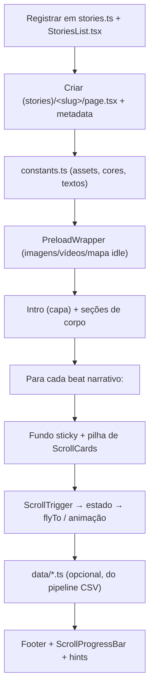

# 06 — Histórias (Scrollytelling)

[← Voltar ao índice](./README.md)

Este é o capítulo mais importante para quem vai produzir conteúdo interativo na
plataforma. Ele documenta o **fluxo completo de criação de uma história** de
data scrollytelling: capa, corpo, cards de texto móveis, bibliotecas usadas, uso
do Mapbox e o fluxo de dados.

## Sumário

- [O que é uma história](#o-que-é-uma-história)
- [Estrutura de pastas de uma história](#estrutura-de-pastas-de-uma-história)
- [As quatro histórias de referência](#as-quatro-histórias-de-referência)
- [Anatomia de uma história](#anatomia-de-uma-história)
  - [1. Composição na `page.tsx`](#1-composição-na-pagetsx)
  - [2. Capa (cover / intro)](#2-capa-cover--intro)
  - [3. Preload (tela de carregamento)](#3-preload-tela-de-carregamento)
  - [4. Corpo (prosa estática)](#4-corpo-prosa-estática)
  - [5. Cards de texto móveis (scrollytelling)](#5-cards-de-texto-móveis-scrollytelling)
- [Bibliotecas de animação](#bibliotecas-de-animação)
- [Uso do Mapbox em histórias](#uso-do-mapbox-em-histórias)
- [Fluxo de dados (CSV → TypeScript)](#fluxo-de-dados-csv--typescript)
- [Componentes e UX compartilhados](#componentes-e-ux-compartilhados)
- [Checklist: criar uma nova história](#checklist-criar-uma-nova-história)
- [Convenções e nomenclatura](#convenções-e-nomenclatura)

---

## O que é uma história

Uma "história" é uma **página de scrollytelling**: uma reportagem baseada em
dados em que mapas, gráficos e imagens (o *fundo fixo*) reagem conforme o leitor
rola a página, guiado por *cards de texto* que passam sobre esse fundo.

Ponto-chave da arquitetura: **não há um CMS nem um schema único de história**.
Cada história é **composta à mão** em uma `page.tsx` que ordena um conjunto de
seções. Isso dá liberdade narrativa total, ao custo de exigir que o
desenvolvedor siga as convenções descritas aqui para manter consistência.

## Estrutura de pastas de uma história

As histórias vivem sob
[`src/app/(app)/historias/`](../../src/app/(app)/historias/). O route group
`(stories)` agrupa as páginas individuais (e força tema claro), **sem afetar a
URL**.

```
historias/
├── page.tsx                 # Índice em /historias (Header + StoriesList)
├── layout.tsx               # Wrapper das rotas de história
├── components/
│   ├── story-logos.tsx      # Logos Insper + Portal (usado nas capas)
│   └── StoryFooter.tsx      # Rodapé compartilhado (créditos, equipes, bases)
├── assets/                  # Assets compartilhados (ex.: logo do portal)
└── (stories)/
    ├── layout.tsx           # Aplica .force-light-theme
    ├── faixa-azul/          # (história de referência — data-driven + mapa)
    ├── adensamento/
    ├── desigualdades-em-saude-sp/
    └── ilhas-de-calor/
```

A história de referência `faixa-azul/` tem a estrutura mais completa:

```
faixa-azul/
├── page.tsx              # Orquestrador: metadata, preload, ordem das seções
├── constants.ts          # URLs de assets, cor de marca, textos da capa
├── components/
│   ├── intro.tsx         # Capa
│   ├── context.tsx       # Corpo introdutório (prosa)
│   ├── preload-wrapper.tsx   # Overlay de loading + MapReadyContext
│   ├── pictogram-section.tsx # Scrolly: gráfico de pictograma
│   ├── media-section.tsx     # Scrolly: mídia (imagem/vídeo)
│   ├── factors-section.tsx   # Scrolly: carrossel de imagens
│   ├── map-section.tsx       # Scrolly: Mapbox (fases A/B)
│   ├── chart-two.tsx         # Scrolly: timeline
│   ├── final-section.tsx     # Scrolly: recomendações
│   ├── map-config.ts         # Estilo Mapbox, fases, GeoJSON, IDs de layer
│   ├── footer.tsx            # Configura o StoryFooter
│   └── ...
└── data/
    ├── transport-charts.ts           # Config de gráficos derivada de CSVs
    ├── acidentes-faixa-azul-data.ts  # Dados da timeline (gerados de CSVs)
    └── faixa_azul/
        ├── README.md                 # Dicionário de dados e metodologia
        └── *.csv                     # Tabelas-fonte
```

## As quatro histórias de referência

Cada história tem um padrão de implementação diferente — escolha a referência
mais próxima do que você vai construir:

| História | Slug | Melhor referência para |
|---|---|---|
| Faixa Azul | `faixa-azul` | História **data-driven com mapa**, gráficos e pipeline de dados documentada (CSV → TS). O modelo mais completo. |
| Adensamento | `adensamento` | Mapbox complexo em arquivo único, triggers dirigidos por config, seção 3D (Three.js). |
| Desigualdades em Saúde | `desigualdades-em-saude-sp` | Seções modulares com **lazy loading** e preloader por imagens. |
| Ilhas de Calor | `ilhas-de-calor` | Mapbox scrolly **e** scrolly de imagem estática (pan/zoom de PNG). |

## Anatomia de uma história

### 1. Composição na `page.tsx`

A `page.tsx` declara os metadados e a ordem narrativa das seções. Exemplo real
(faixa-azul):

```tsx
// src/app/(app)/historias/(stories)/faixa-azul/page.tsx
export const metadata: Metadata = buildMetadata({
  title: "A Faixa Azul tornou o trânsito mais seguro?",
  description: "Avaliação do impacto das faixas dedicadas à motociclistas ...",
  path: "/historias/faixa-azul",
  image: "/assets/viz4/viz4.1.png",
  type: "article",
});

export default function FaixaAzulPage() {
  return (
    <>
      <StoryJsonLd
        title="A Faixa Azul tornou o trânsito mais seguro?"
        description="Avaliação do impacto das faixas dedicadas à motociclistas ..."
        path="/historias/faixa-azul"
        image="/assets/viz4/viz4.1.png"
      />
      <PreloadWrapper imageSources={assetsToPreload} videoSources={videosToPreload}>
        <div className="bg-white!">
          <ScrollProgressBar barColor={brandColor} />
          <Intro />            {/* capa */}
          <Context />          {/* corpo */}
          <PictogramSection /> {/* scrolly: gráfico */}
          <MediaSection />     {/* scrolly: mídia */}
          <FactorsSection />   {/* scrolly: fatores */}
          <MapSection />       {/* scrolly: Mapbox */}
          <OsmText />          {/* corpo */}
          <ChartTwo />         {/* scrolly: timeline */}
          <AfterChartTwoText />
          <FinalSection />     {/* scrolly: recomendações */}
          <Footer />
          <ScrollToTopIcon />
          <ContinueScrollingHint />
        </div>
      </PreloadWrapper>
    </>
  );
}
```

A `page.tsx` pode ser um **Server Component** (como acima) — apenas as seções
interativas precisam de `"use client"`.

### 2. Capa (cover / intro)

A capa é uma seção em tela cheia (`h-screen`) com mídia de fundo (vídeo/imagem),
overlay claro, logos, título e autores. Textos e caminhos de assets ficam em
`constants.ts`:

```ts
// src/app/(app)/historias/(stories)/faixa-azul/constants.ts
export const coverVideo = "/historias/faixa-azul/video-capa.mp4";
export const brandColor = "#23254E";
export const introTitle = "A Faixa Azul tornou o trânsito mais seguro? ...";
export const introAuthors = "Adriano Borges Costa, Adriano Dutra, ...";
```

Padrão do componente de capa (`intro.tsx`):

```tsx
<section className="relative h-screen w-full overflow-hidden flex flex-col items-center justify-center">
  <video autoPlay loop muted playsInline src={coverVideo} className="absolute inset-0 ..." />
  <div className="absolute inset-0 bg-[#FFFFFF]/70" />
  <StoryLogos imageClassName={logoTintClass} />
  <h1>{introTitle}</h1>
  <p>{introAuthors}</p>
  {/* botão de compartilhar (Web Share API) */}
</section>
```

- Use o componente compartilhado
  [`StoryLogos`](../../src/app/(app)/historias/components/story-logos.tsx) para os
  logos.
- A **cor de marca** (`brandColor`) é definida por história e usada em cards,
  barra de progresso e textos.

### 3. Preload (tela de carregamento)

Histórias com mídia pesada usam um **PreloadWrapper** que bloqueia o scroll e
exibe um overlay (uma versão desfocada da capa) até que imagens, vídeos, fontes
e — quando houver mapa — os *tiles* do Mapbox terminem de carregar.

O `PreloadWrapper` da faixa-azul expõe um **`MapReadyContext`**: a seção de mapa
sinaliza `map.once("idle", ...)` quando o mapa termina de carregar, liberando a
capa. Há também um `timeout` de segurança (`MAX_LOADING_MS = 15s`).

```tsx
// preload-wrapper.tsx (resumo)
const MapReadyContext = createContext<() => void>(() => {});
export function useMapReady() { return useContext(MapReadyContext); }

Promise.race([
  Promise.all([
    ...imageSources.map(preloadImage),
    ...videoSources.map(preloadVideo),
    mapReadyPromise,        // resolvido pela MapSection ao ficar "idle"
    document.fonts.ready,
    waitForWindowLoad(),
  ]),
  timeout(MAX_LOADING_MS),  // failsafe
]).then(finishLoading);
```

Estratégias de preload disponíveis (escolha conforme a história):

| Estratégia | Quando usar | Referência |
|---|---|---|
| `PreloadWrapper` + `MapReadyContext` | História **com Mapbox** | `faixa-azul` |
| `PreloadWrapper` só com imagens/vídeos | Muitas imagens, sem mapa | `ilhas-de-calor`, `adensamento` |
| `React.lazy()` + `useImagePreloader` | História muito grande (lazy sections) | `desigualdades-em-saude-sp` |

### 4. Corpo (prosa estática)

Entre os blocos interativos existem seções de **prosa estática** — React puro,
sem biblioteca de scroll. Layout típico: `max-w-xl mx-auto px-6`, fonte Inter,
cor de marca. Exemplos: `context.tsx`, `osm-text.tsx`,
`after-chart-two-text.tsx` (faixa-azul).

### 5. Cards de texto móveis (scrollytelling)

Este é o padrão dominante da plataforma. A ideia:

```
┌─────────────────────────────┐
│  FUNDO FIXO (sticky)         │  position: sticky; top: 0; height: 100vh
│  mapa / gráfico / imagem     │  zIndex: 0
└─────────────────────────────┘
         ↑ permanece fixo
┌─────────────────────────────┐
│  ScrollCard (minHeight 130vh)│  zIndex: 1 — rola por cima do fundo fixo
│    └── CardBox (texto)       │
├─────────────────────────────┤
│  ScrollCard ...              │
│  ScrollCard ...              │
│  spacer (100vh)              │  espaço final opcional
```

O scroll dispara callbacks do **GSAP ScrollTrigger** (`onEnter`, `onEnterBack`,
`onLeave`, `onLeaveBack`) que trocam o estado do fundo fixo (fase do mapa, índice
do gráfico, camada de mídia, etc.).

Dois helpers reutilizados em quase toda seção (hoje redefinidos por arquivo,
não extraídos para um módulo comum):

```tsx
// CardBox: o "card de texto" flutuante
function CardBox({ children }: { children: React.ReactNode }) {
  return (
    <div
      className="w-full max-w-xl rounded-xl p-6 text-sm leading-normal shadow-lg backdrop-blur-sm md:p-8 md:text-base lg:p-9"
      style={{ color: brandColor, backgroundColor: "#F0F0F0" }}
    >
      {children}
    </div>
  );
}

// ScrollCard: alvo alto de scroll que centraliza o CardBox
function ScrollCard({ children, cardRef, minHeight = "130vh" }: ScrollCardProps) {
  return (
    <div
      ref={cardRef}
      className="flex items-center justify-center px-6 md:px-8"
      style={{ minHeight, position: "relative", zIndex: 1 }}
    >
      <CardBox>{children}</CardBox>
    </div>
  );
}
```

Registro dos triggers (recriados no `resize`, mortos no cleanup):

```tsx
// map-section.tsx (resumo)
useLayoutEffect(() => {
  let triggers: ScrollTrigger[] = [];
  const create = () => {
    for (const t of triggers) t.kill();
    triggers = [];
    triggers.push(
      ScrollTrigger.create({
        trigger: card0Ref.current,
        start: "top center",
        end: "bottom center",
        onEnter: () => setPhase("A"),
        onEnterBack: () => setPhase("A"),
        onLeave: () => setPhase("B"),
      }),
    );
    // ...mais triggers...
    requestAnimationFrame(() => ScrollTrigger.refresh());
  };
  requestAnimationFrame(create);
  window.addEventListener("resize", create);
  return () => {
    window.removeEventListener("resize", create);
    for (const t of triggers) t.kill();
  };
}, [setPhase]);
```

> **Regra de ouro:** sempre limpe os triggers no cleanup do efeito e chame
> `ScrollTrigger.refresh()` após o mapa carregar e no `resize`, para
> recalcular as posições de disparo.

## Bibliotecas de animação

O scrollytelling é construído principalmente com **GSAP**:

| Biblioteca | Pacote | Uso |
|---|---|---|
| GSAP | `gsap` | Núcleo de animação (tweens, timelines) |
| ScrollTrigger | `gsap/ScrollTrigger` | Motor de scroll-steps (capítulos por scroll) |
| Lenis | `lenis` / `lenis/react` | Smooth scroll global (sincronizado com o ticker do GSAP) |
| React GSAP | `@gsap/react` (`useGSAP`) | Tweens escopados em componentes React |
| Three.js | `three` | Seção 3D (edifício) na história `adensamento` |
| Swiper | `swiper` | Carrossel (fora de histórias, na home/`sobre`) |
| Image zoom | `react-medium-image-zoom` | Zoom em overlays de mapa (ilhas-de-calor) |

Todo módulo de scrolly registra o plugin uma vez:

```ts
import gsap from "gsap";
import { ScrollTrigger } from "gsap/ScrollTrigger";
gsap.registerPlugin(ScrollTrigger);
```

Observações:

- **IntersectionObserver não é usado** — o ScrollTrigger cobre a detecção de
  visibilidade.
- Barra de progresso e "continue rolando" usam listeners nativos de
  `window.scrollY`. O voltar-ao-topo usa `lenis.scrollTo` para não disputar a
  interpolação do smooth scroll.
- Para scrolly de **imagem estática** (sem mapa), usa-se `gsap.timeline` com
  `scrollTrigger: { scrub: true }` para pan/zoom da imagem
  (ex.: `ilhas-de-calor/components/scroll-map.tsx`).

## Uso do Mapbox em histórias

As histórias usam **`react-map-gl/mapbox`** (wrapper React do Mapbox GL JS), com
um **estilo dedicado do Mapbox Studio** por história.

### Configuração (`map-config.ts`)

Centralize estilo, fases de câmera, IDs de layer e GeoJSON inline:

```ts
// faixa-azul/components/map-config.ts (resumo)
export const MAPBOX_STYLE = "mapbox://styles/observatorio-nacional/cmr6qsef7000401s110l04iqn";
export const TRECHOS_LAYER_ID = "faixa-azul-trechos-spo";

export interface MapPhase { longitude: number; latitude: number; zoom: number; }
export const MAP_PHASE_A: MapPhase = { longitude: -46.63556, latitude: -23.56262, zoom: 13.56 };
export const MAP_PHASE_B: MapPhase = { longitude: -46.5768, latitude: -23.6209, zoom: 10.6 };
export const FLY_TO_DURATION_MS = 2000;
```

### Inicialização

O mapa fica em um container **sticky** e tem a interação do usuário desativada
(o scroll controla a câmera, não o arraste):

```tsx
<div style={{ position: "sticky", top: 0, zIndex: 0 }} className="relative h-screen w-full overflow-hidden">
  <MapboxMap
    ref={mapRef}
    initialViewState={{ longitude: MAP_PHASE_A.longitude, latitude: MAP_PHASE_A.latitude, zoom: MAP_PHASE_A.zoom }}
    mapStyle={MAPBOX_STYLE}
    mapboxAccessToken={process.env.NEXT_PUBLIC_MAPBOX_TOKEN}
    onLoad={handleMapLoad}
    onError={signalMapReady}
    dragPan={false} dragRotate={false} scrollZoom={false} keyboard={false} doubleClickZoom={false}
  >
    <Marker .../>
  </MapboxMap>
</div>
```

### Adicionando sources/layers no `onLoad`

Pequenas geometrias de destaque podem ser adicionadas via GeoJSON inline; redes
maiores vêm de **vector tilesets** do Mapbox:

```tsx
const handleMapLoad = () => {
  const map = getMap(mapRef);
  // GeoJSON inline (destaque):
  map.addSource(PRIMEIRA_IMPLANTACAO_SOURCE_ID, { type: "geojson", data: PRIMEIRA_IMPLANTACAO_GEOJSON });
  map.addLayer({ id: PRIMEIRA_IMPLANTACAO_LAYER_ID, type: "line", source: PRIMEIRA_IMPLANTACAO_SOURCE_ID, paint: {...} });

  // Vector tileset (rede city-wide):
  map.addSource("faixa-azul-trechos", { type: "vector", url: "mapbox://observatorio-nacional.faixa-azul" });
  map.addLayer({ id: TRECHOS_LAYER_ID, type: "line", source: "faixa-azul-trechos", "source-layer": TRECHOS_LAYER_ID, paint: {...} });

  map.once("idle", signalMapReady);            // libera o preload
  requestAnimationFrame(() => ScrollTrigger.refresh());
};
```

### Câmera dirigida pelo scroll (`flyTo` por fase)

Cada card ativa uma "fase" que reposiciona a câmera e liga/desliga camadas:

```tsx
function flyToPhase(map, phase) {
  map.flyTo({ center: [phase.longitude, phase.latitude], zoom: phase.zoom, duration: FLY_TO_DURATION_MS, essential: true });
}

function applyPhase(mapRef, phaseId, currentPhaseRef) {
  const map = getMap(mapRef);
  if (phaseId === "A") {
    flyToPhase(map, MAP_PHASE_A);
    togglePrimeiraImplantacao(map, true);   // setLayoutProperty(..., "visibility", "visible")
    toggleTrechosLayer(map, false);         // setPaintProperty(..., "line-opacity", 0)
  } else {
    flyToPhase(map, MAP_PHASE_B);
    togglePrimeiraImplantacao(map, false);
    toggleTrechosLayer(map, true);
  }
}
```

Padrões de controle de camadas usados nas histórias:

- **Studio-first:** a maioria das camadas já existe no estilo do Studio com
  opacidade 0; o código as liga por passo (`setPaintProperty` /
  `setLayoutProperty`).
- **GeoJSON em runtime:** destaques pequenos adicionados no `onLoad`.
- **Vector tiles:** redes maiores (ex.: `mapbox://observatorio-nacional.faixa-azul`).
- Sempre trate o caso do token ausente (a faixa-azul libera o preload e loga um
  aviso se `NEXT_PUBLIC_MAPBOX_TOKEN` não estiver definido).

## Fluxo de dados (CSV → TypeScript)

Não há fetch em runtime para conteúdo de história. Os dados chegam à UI por três
caminhos:

**A. CSV → módulo TypeScript (modelo faixa-azul).** CSVs brutos em
`data/faixa_azul/` são gerados por scripts em R (documentados no
[README de dados](../../src/app/(app)/historias/(stories)/faixa-azul/data/faixa_azul/README.md)),
e o frontend consome **módulos `.ts` pré-gerados**:

| CSV de origem | Módulo frontend | Consumidor |
|---|---|---|
| `tab_modais_transporte.csv`, `tab_sinistros_*`, `tab_mortes_*` | `data/transport-charts.ts` | `PictogramSection` |
| `tab_avenidas_faixa_azul.csv` + `tab_obitos_faixa_azul.csv` | `data/acidentes-faixa-azul-data.ts` | `TimelineChart` |

Anote a proveniência dos valores no próprio TS (convenção observada):

```ts
// data/transport-charts.ts
categories: [
  { label: "Automóvel", icon: "car", value: 29.9 }, // fornecido (tab_modais_transporte)
  { label: "Motocicleta", icon: "motorbike", value: 2.8 },
],
```

**B. Constantes / GeoJSON inline** em `constants.ts` e `map-config.ts` (fases,
IDs de layer, geometrias de destaque, cores, caminhos de assets).

**C. Mapbox Studio como camada de dados** — tilesets e estilos vivem no Mapbox;
o frontend só referencia a `style URL` e os IDs de layer.

Assets de mídia ficam em `public/historias/<slug>/...` ou em pastas `assets/` /
`images/` co-localizadas e importadas.

## Componentes e UX compartilhados

| Recurso | Caminho | Função |
|---|---|---|
| `StoryLogos` | `historias/components/story-logos.tsx` | Logos da capa |
| `StoryFooter` | `historias/components/StoryFooter.tsx` | Rodapé com créditos/equipes/bases |
| `ScrollProgressBar` | `ilhas-de-calor/components/scroll-progress-bar.tsx` | Barra de progresso no topo |
| `ContinueScrollingHint` | `desigualdades-em-saude-sp/components/continue-scrolling-hint.tsx` | Dica "continue rolando" |
| `ScrollToTopIcon` | `ilhas-de-calor/components/scroll-to-top-icon.tsx` | Botão fixo de voltar ao topo |

> Hoje as histórias importam esses componentes de UX **umas das outras** (não há
> uma pasta `historias/hooks/` ou `historias/shared/` comum). Ao criar novos
> utilitários reutilizáveis, considere movê-los para
> `historias/components/` para reduzir o acoplamento entre histórias.

## Checklist: criar uma nova história

Use este passo a passo para manter o padrão de qualidade.

**1. Crie a pasta e a rota**

```
src/app/(app)/historias/(stories)/<slug-kebab>/
├── page.tsx
├── constants.ts
├── components/
│   ├── intro.tsx        (capa)
│   ├── preload-wrapper.tsx
│   ├── footer.tsx
│   └── ...seções
├── data/                (se data-driven)
└── (mídia em public/historias/<slug>/ ou assets/ co-localizado)
```

A URL será `/historias/<slug-kebab>` (o grupo `(stories)` é invisível).

**2. Defina `constants.ts`** — cor de marca, título, autores, caminhos de mídia.

**3. Implemente a `page.tsx`** — `buildMetadata()` + `StoryJsonLd` +
`PreloadWrapper` + ordem das seções (capa → corpo → scrolly → footer + chrome
de UX). Ver [capítulo 11](./11-seo-e-monitoramento.md) para o contrato de SEO.

**4. Construa a capa** (`intro.tsx`) — `h-screen`, mídia de fundo, `StoryLogos`,
título, autores, botão de compartilhar.

**5. Escolha a estratégia de preload** — ver
[tabela de preload](#3-preload-tela-de-carregamento).

**6. Construa cada seção de scrolly**:
   - `"use client"`.
   - Container **sticky** no topo (`position: sticky; top: 0; height: 100vh; zIndex: 0`).
   - Pilha de `ScrollCard`s com refs (`minHeight: 130vh`).
   - `useLayoutEffect` cria `ScrollTrigger` por card; mata no cleanup e recria no `resize`.
   - O estado (`mapPhase`, `activeIndex`, ...) dirige a animação do fundo.

**7. Se usar Mapbox**:
   - Crie o estilo no Mapbox Studio e anote a `style URL`.
   - Configure `map-config.ts` (estilo, fases/posições, IDs de layer, GeoJSON).
   - Adicione sources/layers no `onLoad`; defina opacidades iniciais.
   - Nos callbacks de scroll, use `map.flyTo({ duration: 2000, essential: true })`
     + visibilidade/opacidade de camadas.
   - Integre o preload via `useMapReady()` + `map.once("idle", signalMapReady)`.
   - Garanta `NEXT_PUBLIC_MAPBOX_TOKEN` no `.env.local`.

**8. Se for data-driven**:
   - Coloque CSVs + `README.md` em `data/<dataset>/`.
   - Documente os scripts de exportação (R) no README (ver modelo faixa-azul).
   - Gere módulos `.ts` tipados consumidos pelos componentes de gráfico.
   - Anote `// fornecido` vs `// config` nos valores.

**9. Registre a história** — em **dois lugares** que devem ficar em sincronia:
   - [`src/lib/data/stories.ts`](../../src/lib/data/stories.ts) → `getStoriesForHome()`
     (home).
   - [`src/components/StoriesList.tsx`](../../src/components/StoriesList.tsx)
     (índice `/historias`).
   - Inclua `href: "/historias/<slug>"`, título, descrição e imagens de preview
     (`/assets/vizN/`).

**10. Configure o rodapé** — envolva `StoryFooter` com os créditos da história
(estudo, equipes, realização, bases de dados).

**11. Adicione o chrome de UX** — `ScrollProgressBar` (com a `brandColor`),
`ScrollToTopIcon` e `ContinueScrollingHint`.

## Convenções e nomenclatura

| Item | Convenção |
|---|---|
| Slug da pasta | kebab-case em português (`faixa-azul`, `ilhas-de-calor`) |
| Arquivos de seção | kebab-case descritivo (`map-section.tsx`, `pictogram-section.tsx`) |
| Cor de marca | constante `brandColor` por história em `constants.ts` |
| Fronteira client | GSAP/Mapbox/scroll → `"use client"`; `page.tsx` pode ser Server Component |
| Cards | `ScrollCard` + `CardBox` locais por seção (ainda não extraídos) |
| Câmera | `flyTo` com `duration: 2000` e `essential: true` |
| Limpeza | matar `ScrollTrigger`s no cleanup; `refresh()` após load/resize |

---

## Diagrama do fluxo de criação



---

[← 05 — Home e Navegação](./05-home-e-navegacao.md) · [Voltar ao índice](./README.md) · [Próximo: 07 — Geoportal →](./07-geoportal.md)
