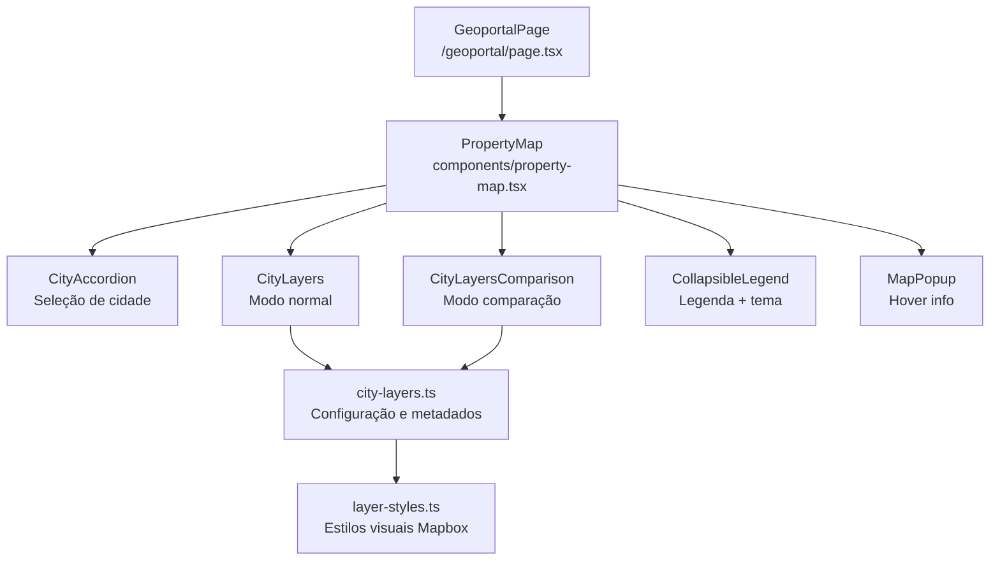
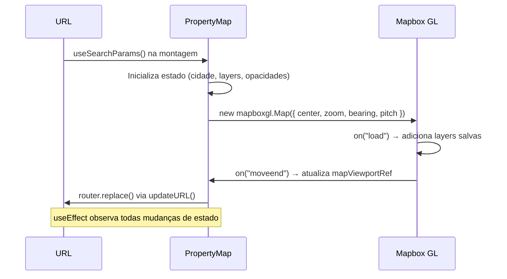
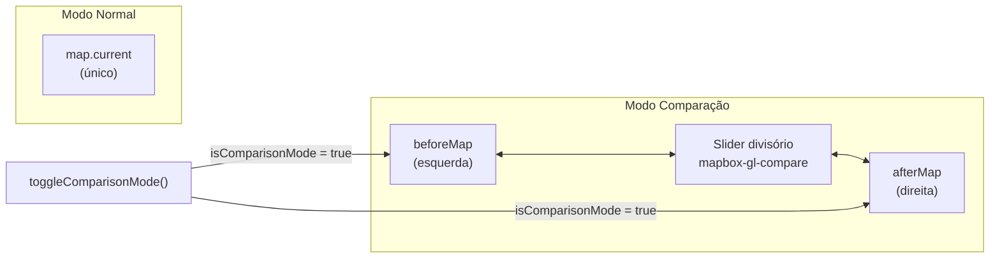

# Geoportal — Documentação Técnica

Mapa interativo baseado em **Mapbox GL JS** que permite visualizar camadas de dados geoespaciais por cidade, com suporte a modo de comparação, estado compartilhável via URL e navegação integrada ao Catálogo de Dados.

---

## Funcionalidades

| Funcionalidade | Descrição |
|---|---|
| **Seleção de cidade** | Rio de Janeiro, São Paulo e Brasil (visão nacional) |
| **Camadas temáticas** | Toggle de layers vetoriais por cidade com opacidade ajustável |
| **Modo comparação** | Visualização lado a lado de duas camadas com slider divisório |
| **Estado na URL** | Toda a visualização é serializável e compartilhável via URL |
| **Integração com catálogo** | Link direto da camada para o registro no Catálogo de Dados |
| **Tema do mapa** | Alternância entre basemap dark e light |
| **Hover popup** | Exibe atributos do feature ao passar o mouse |
| **Legenda automática** | Gerada a partir dos estilos de cada camada |

---

## Arquitetura de Componentes



---

## Estado serializado na URL

Toda a visualização é capturada em query params. Ao copiar e colar a URL, o mapa restaura exatamente o mesmo estado.

### Modo normal

```
/geoportal?city=Rio+de+Janeiro
  &layers=ic_areas-3ii8xj,quali_area-1ci0wo
  &opacity=ic_areas-3ii8xj:50,quali_area-1ci0wo:80
  &zoom=12.2900
  &bearing=17.60
  &pitch=34.50
  &lat=-22.84302
  &lng=-43.26905
  &theme=dark
```

### Modo comparação

```
/geoportal?compare=1
  &city=Rio+de+Janeiro
  &layer1=ic_areas-3ii8xj
  &layer2=quali_area-1ci0wo
  &opacity=ic_areas-3ii8xj:50,quali_area-1ci0wo:80
  &zoom=12.2900&bearing=17.60&pitch=34.50
  &lat=-22.84302&lng=-43.26905
```

### Parâmetros disponíveis

| Param | Tipo | Padrão | Descrição |
|---|---|---|---|
| `city` | string | `""` | Nome da cidade selecionada |
| `layers` | CSV | `""` | IDs das camadas ativas (modo normal) |
| `opacity` | CSV de `id:val` | `""` | Opacidade por camada (0–100) |
| `zoom` | float | zoom da cidade | Nível de zoom do mapa |
| `bearing` | float | `0` | Rotação em graus |
| `pitch` | float | `0` | Inclinação em graus |
| `lat` | float | — | Latitude do centro |
| `lng` | float | — | Longitude do centro |
| `theme` | `dark` \| `light` | `dark` | Tema do basemap |
| `compare` | `1` | — | Ativa modo comparação |
| `layer1` | string | — | Camada esquerda (modo comparação) |
| `layer2` | string | — | Camada direita (modo comparação) |

### Fluxo de leitura/escrita da URL



---

## Camadas disponíveis

### Brasil

| ID | Nome | Catálogo |
|---|---|---|
| `tarifa_zero` | Tarifa Zero | — |

### Rio de Janeiro

| ID | Nome | Catálogo |
|---|---|---|
| `ic_areas-3ii8xj` | Ilhas de Calor | [Item 9](/catalogo-de-dados?item=9) |
| `ic_pontos-90vwh4` | Ilhas de Calor (pontos de captura) | [Item 9](/catalogo-de-dados?item=9) |
| `quali_area-1ci0wo` | Qualidade do Ar | [Item 10](/catalogo-de-dados?item=10) |
| `quali_pontos-b424eh` | Qualidade do Ar (pontos de captura) | [Item 10](/catalogo-de-dados?item=10) |

### São Paulo

| ID | Nome | Catálogo |
|---|---|---|
| `faixa-azul-trechos-spo` | Faixa Azul | [Item 16](/catalogo-de-dados?item=16) |
| `sinistros-por-distrito-spo` | Sinistros por Distrito | [Item 15](/catalogo-de-dados?item=15) |
| `sinistros-por-trecho-spo` | Sinistros em Trechos de Vias | [Item 15](/catalogo-de-dados?item=15) |
| `densidade-hab-setor` | Densidade Hab. (setor censitário) | [Item 3](/catalogo-de-dados?item=3) |
| `densidade-hab-distrito-spo` | Densidade Hab. (distrito) | [Item 3](/catalogo-de-dados?item=3) |
| `densidade-pop-setor-spo` | Densidade Pop. (setor censitário) | [Item 3](/catalogo-de-dados?item=3) |
| `densidade-pop-distrito-spo` | Densidade Pop. (distrito) | [Item 3](/catalogo-de-dados?item=3) |
| `verticalizacao-setor` | Verticalização (setor censitário) | [Item 3](/catalogo-de-dados?item=3) |
| `verticalizacao-distrito-spo` | Verticalização (distrito) | [Item 3](/catalogo-de-dados?item=3) |
| `raster-dbiubd` | Verticalização (grid) | [Item 3](/catalogo-de-dados?item=3) |
| `populacao-por-distrito-spo` | População Feminina (distrito) | [Item 3](/catalogo-de-dados?item=3) |
| `geoses-spo` | GeoSES | [Item 17](/catalogo-de-dados?item=17) |
| `gastos_ubs_distritos-c6rpx4` | Gastos UBS (distrito) | Sem correspondência no catálogo |
| `obitos-47q8aj` | Óbitos por Doenças Cerebrovasculares | [Item 11](/catalogo-de-dados?item=11) |

---

## Modo de Comparação

O modo comparação instancia dois mapas Mapbox independentes (`beforeMap` e `afterMap`) e usa a biblioteca `mapbox-gl-compare` para o slider divisório. Os mapas compartilham o mesmo viewport via sincronização automática do `mapbox-gl-compare`.



**Limitações do modo comparação:**
- Suporta exatamente **1 camada por lado**
- Ao entrar no modo comparação, todas as camadas ativas são removidas
- O viewport é rastreado pelo `beforeMap` (os dois mapas se movem em sincronia)

---

## Integração com o Catálogo de Dados

Quando uma camada está selecionada e possui `catalogItemId` definido em `city-layers.ts`, um link **"Acessar base de dados"** aparece abaixo do slider de opacidade. O caminho inverso (catálogo → geoportal) está documentado em [`docs/CATALOG_GEOPORTAL_INTEGRATION.md`](../../../../../docs/CATALOG_GEOPORTAL_INTEGRATION.md).

---

## Adicionando um novo layer

Siga o guia completo em [`WORKFLOW.md`](./WORKFLOW.md). Em resumo:

1. Fazer upload do tileset no Mapbox Studio (`observatorio-nacional`)
2. Definir o estilo visual em `lib/layer-styles.ts`
3. Registrar os metadados em `lib/city-layers.ts`:

```ts
{
  id: "meu-layer-id",
  name: "Nome na UI",
  description: "Aparece no tooltip de info.",
  tilesetId: "observatorio-nacional.XXXXXXXX",
  sourceLayer: "nome_do_source_layer",
  layerType: "fill",          // fill | line | circle | symbol
  hasCustomStyle: true,
  catalogItemId: "42",        // opcional — ID do item no catálogo
  mapView: {                  // opcional — voo automático ao ativar
    center: [-43.27, -22.84],
    zoom: 12,
    bearing: 0,
    pitch: 0,
  },
}
```

---

## Variáveis de ambiente

```env
NEXT_PUBLIC_MAPBOX_TOKEN=pk.eyJ1...
```

---

## Arquivos do módulo

| Arquivo | Responsabilidade |
|---|---|
| `page.tsx` | Entry point da rota `/geoportal` |
| `components/property-map.tsx` | Orquestrador principal — mapa, estado, URL |
| `components/city-accordion.tsx` | Seleção de cidade |
| `components/city-layers.tsx` | Painel de camadas (modo normal) |
| `components/city-layers-comparison.tsx` | Painel de camadas (modo comparação) |
| `components/collapsible-legend.tsx` | Legenda colapsável + toggle de tema |
| `components/map-legend.tsx` | Renderização da legenda por layer |
| `components/map-popup.tsx` | Popup de hover sobre features |
| `lib/city-layers.ts` | Configuração de camadas por cidade + lookup catálogo |
| `lib/layer-styles.ts` | Estilos visuais Mapbox (paint/layout) |
